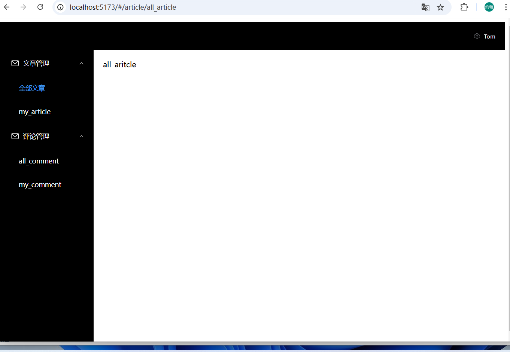

### 创建vue项目

```
pnpm create vite
pnpm install
```

### 安装 element-plus

```
pnpm install element-plus
```

### 修改main.ts

```
// main.ts
import { createApp } from 'vue'
import ElementPlus from 'element-plus'
import 'element-plus/dist/index.css'
import App from './App.vue'

const app = createApp(App)

app.use(ElementPlus)
app.mount('#app')
```

### 安装element图标

```
pnpm install @element-plus/icons-vue
```

### 注册图标

```
// main.ts

// 如果您正在使用CDN引入，请删除下面一行。
import * as ElementPlusIconsVue from '@element-plus/icons-vue'

const app = createApp(App)
for (const [key, component] of Object.entries(ElementPlusIconsVue)) {
  app.component(key, component)
}
```

### 安装@types/node

```
pnpm install @types/node
```

### 支持@别名

vite.config.ts

```
import { defineConfig } from 'vite'
import vue from '@vitejs/plugin-vue'
import {resolve} from 'path'
// https://vite.dev/config/
export default defineConfig({
  plugins: [vue()],
  resolve:{
    alias:{
      '@':resolve(__dirname, 'src')
    }
  }
})

```

tsconfig.app.json

```
......
"noUncheckedSideEffectImports": true,
"paths":{
  "@/*":["./src/*"]
}
```


### 安装vue-router

```
pnpm install vue-router
```

### src/router/index.ts

```
import { createWebHashHistory, createRouter } from 'vue-router'


const routes = [
  { 
    path: '/', 
    name: 'home',
    component: () => import('@/layout/index.vue'),
    children:[
      {
        path: 'article',
        name: '文章管理',
        meta:{
          icon:'food'
        },
        children:[
          { 
            path: '/article/all_article', 
            name: '全部文章',
            component: () => import('@/views/article/all_article.vue') 
          },
          { 
            path: '/article/my_article', 
            name: 'my_article',
            component: () => import('@/views/article/my_article.vue') 
          }
        ]
      },
      {
        path: 'comment',
        name: 'comment',
        meta:{
          icon:'edit'
        },
        children:[
          { 
            path: '/comment/all_comment', 
            name: 'all_comment',
            component: () => import('@/views/comment/all_comment.vue') 
          },
          { 
            path: '/comment/my_comment', 
            name: 'my_comment',
            component: () => import('@/views/comment/my_comment.vue') 
          }
        ]
      }
    ]
  }
]

const router = createRouter({
  history: createWebHashHistory(),
  routes,
})

export default router
```


### 注册路由

```
import { createApp } from 'vue'
import router from './router'
import App from './App.vue'

createApp(App)
  .use(router)
  .mount('#app')
```

### 修改App.vue

```
<template>
  <RouterView></RouterView>
</template>
<script setup lang="ts">

</script>
<style scoped>
</style>

```

### 新增views目录


### src/layout/index.vue

```
<template>
layout 
<RouterView></RouterView>
</template>
<script setup lang="ts">

</script>
<style scoped>
</style>

```

### 复制element文档示例Container布局容器的最后一个示例代码

```
<template>
  <el-container class="layout-container-demo" style="height: 500px">
    <el-aside width="200px">
      <el-scrollbar>
        <el-menu :default-openeds="['1', '3']">
          <el-sub-menu index="1">
            <template #title>
              <el-icon><message /></el-icon>Navigator One
            </template>
            <el-menu-item-group>
              <template #title>Group 1</template>
              <el-menu-item index="1-1">Option 1</el-menu-item>
              <el-menu-item index="1-2">Option 2</el-menu-item>
            </el-menu-item-group>
            <el-menu-item-group title="Group 2">
              <el-menu-item index="1-3">Option 3</el-menu-item>
            </el-menu-item-group>
            <el-sub-menu index="1-4">
              <template #title>Option4</template>
              <el-menu-item index="1-4-1">Option 4-1</el-menu-item>
            </el-sub-menu>
          </el-sub-menu>
          <el-sub-menu index="2">
            <template #title>
              <el-icon><icon-menu /></el-icon>Navigator Two
            </template>
            <el-menu-item-group>
              <template #title>Group 1</template>
              <el-menu-item index="2-1">Option 1</el-menu-item>
              <el-menu-item index="2-2">Option 2</el-menu-item>
            </el-menu-item-group>
            <el-menu-item-group title="Group 2">
              <el-menu-item index="2-3">Option 3</el-menu-item>
            </el-menu-item-group>
            <el-sub-menu index="2-4">
              <template #title>Option 4</template>
              <el-menu-item index="2-4-1">Option 4-1</el-menu-item>
            </el-sub-menu>
          </el-sub-menu>
          <el-sub-menu index="3">
            <template #title>
              <el-icon><setting /></el-icon>Navigator Three
            </template>
            <el-menu-item-group>
              <template #title>Group 1</template>
              <el-menu-item index="3-1">Option 1</el-menu-item>
              <el-menu-item index="3-2">Option 2</el-menu-item>
            </el-menu-item-group>
            <el-menu-item-group title="Group 2">
              <el-menu-item index="3-3">Option 3</el-menu-item>
            </el-menu-item-group>
            <el-sub-menu index="3-4">
              <template #title>Option 4</template>
              <el-menu-item index="3-4-1">Option 4-1</el-menu-item>
            </el-sub-menu>
          </el-sub-menu>
        </el-menu>
      </el-scrollbar>
    </el-aside>

    <el-container>
      <el-header style="text-align: right; font-size: 12px">
        <div class="toolbar">
          <el-dropdown>
            <el-icon style="margin-right: 8px; margin-top: 1px">
              <setting />
            </el-icon>
            <template #dropdown>
              <el-dropdown-menu>
                <el-dropdown-item>View</el-dropdown-item>
                <el-dropdown-item>Add</el-dropdown-item>
                <el-dropdown-item>Delete</el-dropdown-item>
              </el-dropdown-menu>
            </template>
          </el-dropdown>
          <span>Tom</span>
        </div>
      </el-header>

      <el-main>
        <el-scrollbar>
          <el-table :data="tableData">
            <el-table-column prop="date" label="Date" width="140" />
            <el-table-column prop="name" label="Name" width="120" />
            <el-table-column prop="address" label="Address" />
          </el-table>
        </el-scrollbar>
      </el-main>
    </el-container>
  </el-container>
</template>

<script lang="ts" setup>
import { ref } from 'vue'
import { Menu as IconMenu, Message, Setting } from '@element-plus/icons-vue'

const item = {
  date: '2016-05-02',
  name: 'Tom',
  address: 'No. 189, Grove St, Los Angeles',
}
const tableData = ref(Array.from({ length: 20 }).fill(item))
</script>

<style scoped>
.layout-container-demo .el-header {
  position: relative;
  background-color: var(--el-color-primary-light-7);
  color: var(--el-text-color-primary);
}
.layout-container-demo .el-aside {
  color: var(--el-text-color-primary);
  background: var(--el-color-primary-light-8);
}
.layout-container-demo .el-menu {
  border-right: none;
}
.layout-container-demo .el-main {
  padding: 0;
}
.layout-container-demo .toolbar {
  display: inline-flex;
  align-items: center;
  justify-content: center;
  height: 100%;
  right: 20px;
}
</style>

```

### 修改成如下

```
<template>
  <el-container class="layout-container-demo">
    <el-header style="text-align: right; font-size: 12px">
      <div class="toolbar">
        <el-dropdown>
          <el-icon style="margin-right: 8px; margin-top: 1px">
            <setting />
          </el-icon>
          <template #dropdown>
            <el-dropdown-menu>
              <el-dropdown-item>View</el-dropdown-item>
              <el-dropdown-item>Add</el-dropdown-item>
              <el-dropdown-item>Delete</el-dropdown-item>
            </el-dropdown-menu>
          </template>
        </el-dropdown>
        <span>Tom</span>
      </div>
    </el-header>

    <el-container>
      <el-aside width="200px">
        <el-menu router background-color="#000" text-color="#fff">
          <el-sub-menu index="/article">
            <template #title>
              <el-icon>
                <message />
              </el-icon>文章管理
            </template>
            <el-menu-item index="/article/all_article">全部文章</el-menu-item>
            <el-menu-item index="/article/my_article">my_article</el-menu-item>
          </el-sub-menu>
          <el-sub-menu index="/comment">
            <template #title>
              <el-icon>
                <message />
              </el-icon>评论管理
            </template>
            <el-menu-item index="/comment/all_comment">all_comment</el-menu-item>
            <el-menu-item index="/comment/my_comment">my_comment</el-menu-item>
          </el-sub-menu>
        </el-menu>
      </el-aside>

      <el-main>
        <RouterView></RouterView>
      </el-main>
    </el-container>
  </el-container>
</template>

<script lang="ts" setup>
import { Message, Setting } from '@element-plus/icons-vue'

</script>

<style scoped>
.layout-container-demo{
  height: 100%;
}
.layout-container-demo .el-header {
  background-color: black;
  color: white;
}

.layout-container-demo .el-aside {
  color: white;
  background: black;
}

.layout-container-demo .el-menu {
  border-right: none;
}

.layout-container-demo .toolbar {
  display: inline-flex;
  align-items: center;
  justify-content: center;
  height: 100%;
}
</style>
```

### 解析一下样式


最外层el-container高度100%，el-header有个固定高度，里面el-container占据剩余空间

### 修改main.ts

```
import '@/style.css'
```

### 修改sytle.css

```
html,body,#app{
  height: 100%;
}
```

### 最终效果



### 更动态的写法

```
<template>
  <el-container class="layout-container-demo">
    <el-header style="text-align: right; font-size: 12px">
      <div class="toolbar">
        <el-dropdown>
          <el-icon style="margin-right: 8px; margin-top: 1px">
            <setting />
          </el-icon>
          <template #dropdown>
            <el-dropdown-menu>
              <el-dropdown-item>View</el-dropdown-item>
              <el-dropdown-item>Add</el-dropdown-item>
              <el-dropdown-item>Delete</el-dropdown-item>
            </el-dropdown-menu>
          </template>
        </el-dropdown>
        <span>Tom</span>
      </div>
    </el-header>

    <el-container>
      <el-aside width="200px">
        <el-menu router background-color="#000" text-color="#fff">
          <el-sub-menu v-for="item in routes" :index="item.path">
      <template #title>
        <el-icon>
          <component :is="item.meta.icon"></component>
          <!-- <food /> -->
        </el-icon>
        <span>{{item.name}}</span>
      </template>
      <el-menu-item v-for="child in item.children" :index="child.path">{{child.name}}</el-menu-item>
    </el-sub-menu>
        </el-menu>
      </el-aside>

      <el-main>
        <RouterView></RouterView>
      </el-main>
    </el-container>
  </el-container>
</template>

<script lang="ts" setup>
import { Message, Setting } from '@element-plus/icons-vue'
import {useRouter} from 'vue-router'
const router = useRouter()

const routes = router.getRoutes().filter((item)=>{
  return item.children.length > 0 && item.name !== 'home'
})
</script>

<style scoped>
.layout-container-demo{
  height: 100%;
}
.layout-container-demo .el-header {
  background-color: black;
  color: white;
}

.layout-container-demo .el-aside {
  color: white;
  background: black;
}

.layout-container-demo .el-menu {
  border-right: none;
}

.layout-container-demo .toolbar {
  display: inline-flex;
  align-items: center;
  justify-content: center;
  height: 100%;
}
</style>
```

