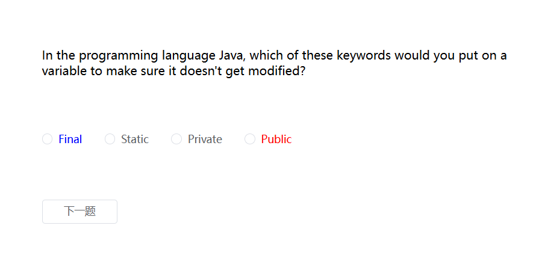

### 代码

```
https://github.com/kamibababa/vue3-element-router-pinia-quiz-app
```

### 效果



### 新建vue3项目并安装依赖

```
{
  "name": "realworld-vue",
  "private": true,
  "version": "0.0.0",
  "type": "module",
  "scripts": {
    "dev": "vite",
    "build": "vue-tsc -b && vite build",
    "preview": "vite preview"
  },
  "dependencies": {
    "@element-plus/icons-vue": "^2.3.1",
    "axios": "^1.7.7",
    "element-plus": "^2.8.5",
    "pinia": "^2.2.4",
    "pinia-plugin-persistedstate": "^4.1.3",
    "vue": "^3.5.10",
    "vue-router": "^4.4.5"
  },
  "devDependencies": {
    "@types/node": "^22.7.5",
    "@vitejs/plugin-vue": "^5.1.4",
    "typescript": "^5.5.3",
    "vite": "^5.4.8",
    "vue-tsc": "^2.1.6"
  }
}

```

### 接口地址

```
https://opentdb.com/api.php?amount=10&category=18&difficulty=easy&type=multiple
```

### 返回json

```json
{
    "response_code": 0,
    "results": [
        {
            "type": "multiple",
            "difficulty": "easy",
            "category": "Science: Computers",
            "question": "In computing, what does MIDI stand for?",
            "correct_answer": "Musical Instrument Digital Interface",
            "incorrect_answers": [
                "Musical Interface of Digital Instruments",
                "Modular Interface of Digital Instruments",
                "Musical Instrument Data Interface"
            ]
        },
        {
            "type": "multiple",
            "difficulty": "easy",
            "category": "Science: Computers",
            "question": "What amount of bits commonly equals one byte?",
            "correct_answer": "8",
            "incorrect_answers": [
                "1",
                "2",
                "64"
            ]
        },
        {
            "type": "multiple",
            "difficulty": "easy",
            "category": "Science: Computers",
            "question": "When Gmail first launched, how much storage did it provide for your email?",
            "correct_answer": "1GB",
            "incorrect_answers": [
                "512MB",
                "5GB",
                "Unlimited"
            ]
        }
        ......
    ]
}
```

### 配置代理及@别名

```js
import { defineConfig, loadEnv,ConfigEnv } from 'vite'
import vue from '@vitejs/plugin-vue'
import {resolve} from 'path'
// https://vitejs.dev/config/
export default defineConfig(({ mode }: ConfigEnv)=>{
  const env = loadEnv(mode, process.cwd());
  return {
    plugins: [vue()],
    server: {
      // 允许IP访问
      host: "0.0.0.0",
      // 应用端口 (默认:3000)
      port: Number(3000),
      // 运行是否自动打开浏览器
      open: true,
      proxy: {
        /** 代理前缀为 /dev-api 的请求  */
        [env.VITE_APP_API]: {
          changeOrigin: true,
          // 接口地址
          target: env.VITE_APP_API_URL,
          rewrite: (path) =>
            path.replace(new RegExp("^" + env.VITE_APP_API), ""),
        },
      },
    },
    resolve:{
      alias:{
        '@':resolve(__dirname, 'src')
      }
    }
  }
})


```

### .env

```
VITE_APP_API = /dev-api
VITE_APP_API_URL = https://opentdb.com/api.php
```


### main.ts

```ts
import { createApp } from 'vue'
import '@/main.css'
import App from '@/App.vue'
import router from '@/router'
import { createPinia }  from 'pinia'

import ElementPlus from 'element-plus'
import 'element-plus/dist/index.css'
import * as ElementPlusIconsVue from '@element-plus/icons-vue'
import piniaPluginPersistedstate from 'pinia-plugin-persistedstate';
 
const pinia = createPinia();
pinia.use(piniaPluginPersistedstate);
const app = createApp(App)

for (const [key, component] of Object.entries(ElementPlusIconsVue)) {
  app.component(key, component)
}

app.use(ElementPlus)
app.use(pinia)
app.use(router)

app.mount('#app')

```

### App.vue

```vue
<template>
  <RouterView></RouterView>
</template>
<script setup lang="ts">

</script>
<style scoped>
</style>

```

### model

```typescript
export interface Result_Rsp {
  response_code: number;
  results: Result[];
}
export interface Result {
  type: string;
  difficulty: string;
  category: string;
  question: string;
  correct_answer: string;
  incorrect_answers: string[];
  true_answers?: string[];
  student_answer: string;
}
```

### api

```ts
import instance from "@/utils/request"; 
import { Result_Rsp } from "@/model/"

export function getQuestions(): Promise<{data: Result_Rsp}>{
  return instance({
    method: 'get',
    url: '?amount=10&category=18&difficulty=easy&type=multiple'
  })
}
```

### router

```js
import { createWebHashHistory, createRouter } from 'vue-router'


const routes = [
  { 
    path: '/', 
    name: 'home',
    redirect:'/all_question'
  },
  { 
    path: '/all_question', 
    name: 'all_question',
    component: () => import('@/views/question/all_question.vue') 
  },
  { 
    path: '/check_question', 
    name: 'check_question',
    component: () => import('@/views/question/check_question.vue') 
  }
]

const router = createRouter({
  history: createWebHashHistory(),
  routes,
})


export default router
```

### request.ts

```ts
import axios from "axios";


const instance = axios.create({
  // baseURL: 'https://api.realworld.io/api/'
  //  baseURL: 'http://10.88.54.43:8088/api/'
  baseURL: import.meta.env.VITE_APP_API//dev-api
});


export default instance
```

### store

```ts
import { defineStore } from 'pinia'
import { ref } from 'vue'
import { Result } from '@/model'

export const useResultStore = defineStore('result', () => {
  const resultInfo = ref<Result[]>([])

  function setResultInfo(value: Result[]) {
    resultInfo.value = value.slice();
  }

  return {
    resultInfo,
    setResultInfo
  }
}, {

  persist: {
    storage: sessionStorage
  }
})
```

### all_question.vue

```vue
<template>
  <div class="container">
    <div v-html="questions.results[question_index]?.question"></div>
  <el-radio-group v-model="student_answer">
    <el-radio v-for="answer in questions.results[question_index]?.true_answers" :value="answer" @change="nextQuestion"><span v-html="answer"></span></el-radio>
  </el-radio-group>

  <template v-if="question_index >= 10">
    <div>{{ final_score }}</div>
    <el-button size="small" @click="getScore">查看结果</el-button>
  </template>
  </div>

</template>
<script setup lang="ts">
import { getQuestions } from '@/api';
import { Result_Rsp } from '@/model';
import { ref } from 'vue';
import { useRouter } from 'vue-router'
import { useResultStore } from '@/store/result'
const questions = ref<Result_Rsp>({
  response_code: 0,
  results: []
})
const router = useRouter()
const question_index = ref(0)
const final_score = ref(0)

const student_answer = ref<string>('')

getQuestions().then(res => {
  questions.value = res.data
  questions.value.results = questions.value.results.map((item, index, arr) => {
    item.true_answers = []
    item.true_answers = arr[index].incorrect_answers.slice();
    item.true_answers.push(arr[index].correct_answer);
    item.true_answers.sort((a, b) => {
      return Math.random() > 0.5 ? 1 : -1
    })
    return item
  })
  console.log(questions.value);
})

function nextQuestion() {
  questions.value.results[question_index.value].student_answer = student_answer.value
  question_index.value++
  if(question_index.value<10){
    return
  }
  let arr = questions.value.results.filter((item) => {
    return item.correct_answer === item.student_answer
  })
  final_score.value = 10 * arr.length
}

function getScore() {

  let { setResultInfo } = useResultStore()
  setResultInfo(questions.value.results)
  router.push('/check_question')
}


</script>
<style scoped>
.container{
  height: 300px;
  margin: 30px 0 0 50px;
  display: flex;
  flex-direction: column;
  justify-content: space-around;
}
</style>

```

### check_question.vue

```vue

<template>
    <div class="container">
      <div v-html="resultInfo[question_index]?.question"></div>
  <el-radio-group >
    <el-radio v-for="answer in resultInfo[question_index]?.true_answers" :value="answer">
     <span v-if="answer===resultInfo[question_index].correct_answer" style="color: blue;" v-html="answer"></span> 
     <span v-else-if="answer===resultInfo[question_index].student_answer&&answer!==resultInfo[question_index].correct_answer" style="color: red;" v-html="answer"></span> 
     <span v-else v-html="answer"></span> 
    </el-radio>
  </el-radio-group>
  <el-button style="max-width: 100px;" v-if="question_index < 10" @click="nextQuestion">下一题</el-button>
  <template v-else>
    <el-button style="max-width: 100px;" @click="startQuestion">重新答题</el-button>
  </template>
    </div>
</template>

<script setup lang="ts">
import { useResultStore } from '@/store/result'
import { storeToRefs } from 'pinia'
import { ref } from 'vue';
import { useRouter } from 'vue-router'

const router = useRouter()
const store = useResultStore()
let { resultInfo } = storeToRefs(store)
const question_index = ref(0)

function nextQuestion() {
  question_index.value++
}
function startQuestion() {
  router.push('/all_question')
}

</script>
<style scoped>
.container{
  height: 300px;
  margin: 30px 0 0 50px;
  display: flex;
  flex-direction: column;
  justify-content: space-around;
}
</style>

```

