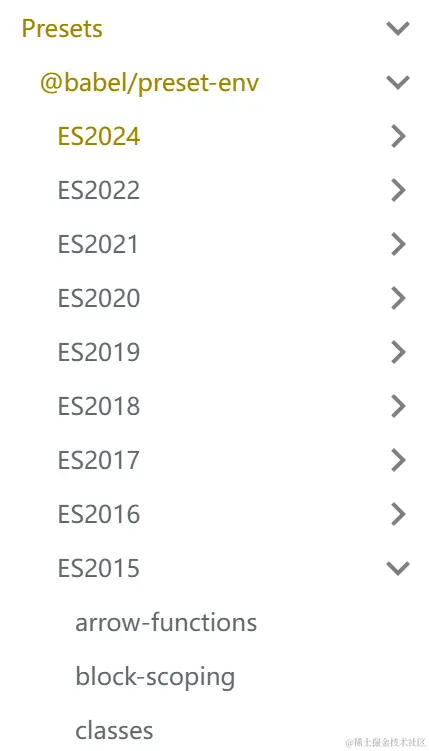
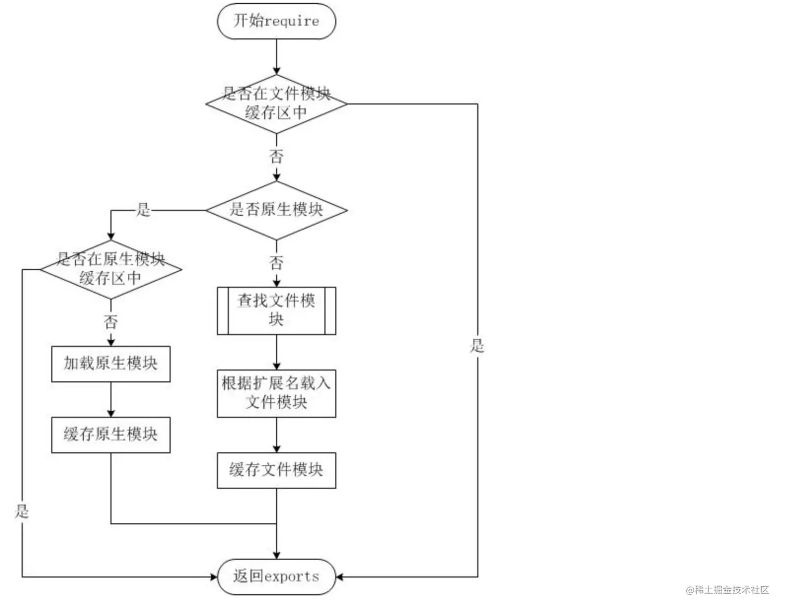

之前有过一次面试，对于前端开发者，会一门后台语言这是必要的了。

当时被问过这么几个问题，虽然文章内容中我没有写，大家可以去带着这些问题来学习，找一下对应的答案，也是一种提升！

*   浏览器的事件循环和node的事件循环有什么不同？
*   `commonjs`的`require`的实现原理？
*   ES6的`import`和`commonjs`的require有什么不同？
*   手写一个`EventEmmit`类

后续会针对这些问题，出一篇文章，欢迎大家的关注。

Node
----

### 为什么要学习Nodejs

*   企业需求
    *   具有服务端开发经验更好
    *   全栈工程师
    *   基本的网站开发能力
        *   服务端
        *   前端
        *   运维部署相关工作

### Node是什么

Node.js 是一个基于 Chrome V8 引擎的 JavaScript 运行环境。  Node.js 使用了一个[**事件驱动**](https://link.juejin.cn/?target=https%3A%2F%2Fnodejs.org%2Fen%2Fdocs%2Fguides%2Fevent-loop-timers-and-nexttick%2F "https://nodejs.org/en/docs/guides/event-loop-timers-and-nexttick/")、[**非阻塞式 I/O**](https://link.juejin.cn/?target=https%3A%2F%2Fnodejs.org%2Fen%2Fdocs%2Fguides%2Fblocking-vs-non-blocking%2F "https://nodejs.org/en/docs/guides/blocking-vs-non-blocking/") 的模型，使其轻量又高效。

目前稳定版本:14.15.1 LTS(Long Term Support) 长期支持版本

### 安装node

官网下载=>一键式安装,点点点就可以进行安装。

ps：如果windows电脑的同学在安装时修改了安装路径，请自行去_修改环境变量_

> 当然现在node的最新版本是14.15.1，大家可以现在下载最新版本进行安装



表示安装成功

#### 准备工作

*   运行node程序
    
    ```
    console.log('hello node');
    console.log('run my use:node 01-runnode');
    
    ```
    
    运行:node 01-runnode.js
    
    > 每次修改js文件需要重新执行才会生效,安装nodemon 可以监视文件改动,自动重启
    > 
    > npm i -g nodemon
    
    以后运行 用`nodemon 01-runnode.js`
    
*   调式node程序:`Debug-Start Debugging`
    

### REPL(交互式解释器)

*   表达式运算
*   使用变量
*   多行表达式
*   REPL命令
    *   ctrl + c - 退出当前终端。
    *   ctrl + c 按下两次 - 退出 Node REPL。
    *   ctrl + d - 退出 Node REPL.
    *   向上/向下 键 - 查看输入的历史命令
    *   tab 键 - 列出当前命令
    *   .help - 列出使用命令
    *   .break - 退出多行表达式
    *   .clear - 退出多行表达式
    *   .save filename - 保存当前的 Node REPL 会话到指定文件
    *   .load filename - 载入当前 Node REPL 会话的文件内容。

### 回调函数

Node.js 异步编程的直接体现就是回调。

异步编程依托于回调来实现，但不能说使用了回调后程序就异步化了。

回调函数在完成任务后就会被调用，Node 使用了大量的回调函数，Node 所有 API 都支持回调函数。

例如，我们可以一边读取文件，一边执行其他命令，在文件读取完成后，我们将文件内容作为回调函数的参数返回。这样在执行代码时就没有阻塞或等待文件 `I/O` 操作。这就大大提高了 `Node.js` 的性能，可以处理大量的并发请求。

#### 阻塞代码

```
// 阻塞式代码
const fs = require('fs');
const data = fs.readFileSync('01-runnode.js');
console.log(data.toString());

```

#### 非阻塞代码

```
const fs = require('fs');
fs.readFile('01-runnode.j',function(err,data) {
    if(err){
        console.log(err.stack);
        return;
    }
    console.log(data.toString());
});
console.log('继续执行');

```

第一个实例在文件读取完后才执行完程序。 第二个实例我们不需要等待文件读取完，这样就可以在读取文件时同时执行接下来的代码，大大提高了程序的性能。

因此，阻塞按是按顺序执行的，而非阻塞是不需要按顺序的，所以如果需要处理回调函数的参数，我们就需要写在回调函数内。

### 事件循环

Node.js 是单进程单线程应用程序，但是通过事件和回调支持并发，所以性能非常高。

Node.js 的每一个 API 都是异步的，并作为一个独立线程运行，使用异步函数调用，并处理并发。

Node.js 基本上所有的事件机制都是用设计模式中观察者模式实现。

Node.js 单线程类似进入一个`while(true)`的事件循环，直到没有事件观察者退出，每个异步事件都生成一个事件观察者，如果有事件发生就调用该回调函数.

### 事件驱动程序

Node.js 使用事件驱动模型，当`web server`接收到请求，就把它关闭然后进行处理，然后去服务下一个web请求。

当这个请求完成，它被放回处理队列，当到达队列开头，这个结果被返回给用户。

这个模型非常高效可扩展性非常强，因为`webserver`一直接受请求而不等待任何读写操作。（这也被称之为非阻塞式IO或者事件驱动IO）

在事件驱动模型中，会生成一个主循环来监听事件，当检测到事件时触发回调函数。


整个事件驱动的流程就是这么实现的，非常简洁。有点类似于观察者模式，事件相当于一个主题(Subject)，而所有注册到这个事件上的处理函数相当于观察者(Observer)。

Node.js 有多个内置的事件，我们可以通过引入 events 模块，并通过实例化 EventEmitter 类来绑定和监听事件，如下实例：

创建 03-eventEmitter.js

```
// 引入event 模块
const events = require('events');

// 创建eventEmitter对象
const eventEmitter = new events.EventEmitter();

// 创建事件处理程序
const connectHandler = function connected() {
    console.log('连接成功');
    // 触发 data_received事件
    eventEmitter.emit('data_received');
}

// 绑定 connection 事件处理程序
eventEmitter.on('connection', connectHandler);

// 使用匿名函数绑定 data_received 事件
eventEmitter.on('data_received',function() {
    console.log('数据接收成功');
})

// 触发 connection事件
eventEmitter.emit('connection');
console.log('程序执行完毕');


```

执行:

```
连接成功
数据接收成功
程序执行完毕

```

### Buffer(缓冲区)

JavaScript 语言自身只有字符串数据类型，没有二进制数据类型。

但在处理像TCP流或文件流时，必须使用到二进制数据。因此在 Node.js中，定义了一个 `Buffer` 类，该类用来创建一个专门存放二进制数据的缓存区。

在 Node.js 中，`Buffer` 类是随 Node 内核一起发布的核心库。`Buffer` 库为 Node.js 带来了一种存储原始数据的方法，可以让 Node.js 处理二进制数据，每当需要在 Node.js 中处理I/O操作中移动的数据时，就有可能使用 `Buffer` 库。原始数据存储在 `Buffer` 类的实例中。一个 `Buffer` 类似于一个整数数组，但它对应于 V8 堆内存之外的一块原始内存。

```
// buffer: 八位字节组成数组,可以有效的在js中存储二进制数据
// 创建
const buf1 = Buffer.alloc(10);
console.log(buf1);
// 通过数据创建
const buf2 = Buffer.from('hello world');
console.log(buf2);

const buf3 = Buffer.from([1,2,3]);
console.log(buf3);

// 写入
buf1.write('hello buffer');
console.log(buf1);

// 读取
console.log(buf2.toString());
console.log(buf2.toString('base64'));

// 合并
const buf4 = Buffer.concat([buf1,buf2]);
console.log(buf4.toString());

```

### Stream(流)

#### 管道流

管道提供了一个输出流到输入流的机制。通常我们用于从一个流中获取数据并将数据传递到另外一个流中。


如上面的图片所示，我们把文件比作装水的桶，而水就是文件里的内容，我们用一根管子(pipe)连接两个桶使得水从一个桶流入另一个桶，这样就慢慢的实现了大文件的复制过程。

以下实例我们通过读取一个文件内容并将内容写入到另外一个文件中。

```
const fs = require('fs');
// 创建可读流
const readerStream = fs.createReadStream('./package.json');
// 创建可写流
const writerStream = fs.createWriteStream('./test.txt');
// 设置编码为utf8
readerStream.pipe(writerStream);
console.log('执行完毕');

```

**链式流**

链式是通过连接输出流到另外一个流并创建多个流操作链的机制。链式流一般用于管道操作

接下来我们就是用管道和链式来压缩和解压文件。

```
const fs = require('fs');
const zlib = require('zlib');
// 压缩test.txt为test.zip
fs.createReadStream('./test.txt').pipe(zlib.createGzip()).pipe(fs.createWriteStream('test.zip'));
console.log('文件压缩成功');

```

### 模块系统

为了让Node.js的文件可以相互调用，Node.js提供了一个简单的模块系统。

模块是Node.js 应用程序的基本组成部分，文件和模块是一一对应的。换言之，一个 Node.js 文件就是一个模块，这个文件可能是JavaScript 代码、JSON 或者编译过的C/C++ 扩展。

#### **模块CommonJS**

在Node.js中,创建一个模块非常简单,创建main.js

```
const Hello = require('./hello');
hello.world();

```

Node.js 提供了exports 和 require 两个对象，其中 exports 是模块公开的接口，require 用于从外部获取一个模块的接口，即所获取模块的 exports 对象

接下来我们就来创建hello.js文件，代码如下：

```
exports.world = function() {
   console.log('hello world');
}

```

有时候我们只是想把一个对象封装到模块中，格式如下

```
module.exports = function() {
  // ...
}

```

例如:

```
function Hello() {
    let name;
    this.setName = function(myName) {
        name = myName
    }
    this.sayHello = function() {
        console.log('hello', name);

    }
}
module.exports = Hello;

```

这样就可以直接获得这个对象了：

```
const hello = new Hello();
hello.setName('小马哥');
hello.sayHello();

```

模块接口的唯一变化是使用 `module.exports = Hello` 代替了`exports.world = function(){}`。 在外部引用该模块时，其接口对象就是要输出的 `Hello` 对象本身，而不是原先的 `exports`。

#### 服务端的模块放在哪里

也许你已经注意到，我们已经在代码中使用了模块了。像这样：

```
const fs = require('fs');

fs.createReadStream(...)

```

Nodejs中有很多常用的内置模块,下节有介绍

Node.js的`require`方法中的文件查找策略如下(面试必看,熟悉模块查找的机制)

由于Node.js中存在4类模块（原生模块和3种文件模块），尽管`require`方法极其简单，但是内部的加载却是十分复杂的，其加载优先级也各自不同。如下图所示：



**从文件模块缓存中加载**

尽管原生模块与文件模块的优先级不同，但是都不会优先于从文件模块的缓存中加载已经存在的模块。

**从原生模块加载**

原生模块的优先级仅次于文件模块缓存的优先级。require方法在解析文件名之后，优先检查模块是否在原生模块列表中。以http模块为例，尽管在目录下存在一个http/http.js/http.node/http.json文件，require("http")都不会从这些文件中加载，而是从原生模块中加载。 原生模块也有一个缓存区，同样也是优先从缓存区加载。如果缓存区没有被加载过，则调用原生模块的加载方式进行加载和执行。

**从文件加载**

当文件模块缓存中不存在，而且不是原生模块的时候，Node.js会解析require方法传入的参数，并从文件系统中加载实际的文件，加载过程中的包装和编译细节在前一节中已经介绍过，这里我们将详细描述查找文件模块的过程，其中，也有一些细节值得知晓。 require方法接受以下几种参数的传递：

*   http、fs、path等，原生模块。
*   ./mod或../mod，相对路径的文件模块。
*   /pathtomodule/mod，绝对路径的文件模块。
*   mod，非原生模块的文件模块。

### 常用内置模块

#### fs模块

**异步和同步**

**打开文件**

```
fs.open(path, flags[, mode], callback)

```

参数

*   path - 文件的路径。
    
*   flags - 文件打开的行为。具体值详见下文。
    
*   mode - 设置文件模式(权限)，文件创建默认权限为 0666(可读，可写)。
    
*   callback - 回调函数，带有两个参数如：callback(err, fd)。
    
    flags 参数可以是以下值：
    
    | Flag | 描述 |
    | --- | --- |
    | **r** | 以读取模式打开文件。如果文件不存在抛出异常。 |
    | **r+** | 以读写模式打开文件。如果文件不存在抛出异常。 |
    | **rs** | 以同步的方式读取文件。 |
    | **rs+** | 以同步的方式读取和写入文件。 |
    | **w** | 以写入模式打开文件，如果文件不存在则创建。 |
    | **wx** | 类似 'w'，但是如果文件路径存在，则文件写入失败。 |
    | **w+** | 以读写模式打开文件，如果文件不存在则创建。 |
    | **wx+** | 类似 'w+'， 但是如果文件路径存在，则文件读写失败。 |
    | **a** | 以追加模式打开文件，如果文件不存在则创建。 |
    | **ax** | 类似 'a'， 但是如果文件路径存在，则文件追加失败。 |
    | **a+** | 以读取追加模式打开文件，如果文件不存在则创建。 |
    | **ax+** | 类似 'a+'， 但是如果文件路径存在，则文件读取追加失败。 |
    
    **写入文件**
    
    ```
    fs.writeFile(filename, data[, options], callback)
    
    ```
    
    如果文件存在，该方法写入的内容会覆盖旧的文件内容。
    
    参数使用说明如下：
    
    *   **path** - 文件路径。
    *   **data** - 要写入文件的数据，可以是 String(字符串) 或 Buffer(流) 对象。
    *   **options** - 该参数是一个对象，包含 {encoding, mode, flag}。默认编码为 utf8, 模式为 0666 ， flag 为 'w'
    *   **callback** - 回调函数，回调函数只包含错误信息参数(err)，在写入失败时返回。
    
    **读取文件**
    
    ```
    fs.read(fd, buffer, offset, length, position, callback)
    
    ```
    
    **关闭文件**
    
    ```
    fs.close(fd, callback)
    
    ```
    
    **截取文件**
    
    ```
    fs.ftruncate(fd, len, callback)
    
    ```
    
    参数使用说明如下：
    
    *   **fd** - 通过 fs.open() 方法返回的文件描述符。
    *   **len** - 文件内容截取的长度。
    *   **callback** - 回调函数，没有参数
    
    **删除文件**
    
    ```
    fs.unlink(path, callback)
    
    ```
    
    参数使用说明如下：
    
    *   **path** - 文件路径。
    *   **callback** - 回调函数，没有参数。
    
    **创建目录**
    
    ```
    fs.mkdir(path[, mode], callback)
    
    ```
    
    *   **path** - 文件路径。
        
    *   **mode** - 设置目录权限，默认为 0777。
        
    *   **callback** - 回调函数，没有参数。
        
    
    **读取目录**
    
    ```
    fs.readdir(path, callback)
    
    ```
    
    参数使用说明如下：
    
    *   **path** - 文件路径。
    *   **callback** - 回调函数，回调函数带有两个参数err, files，err 为错误信息，files 为 目录下的文件数组列表
    
    **删除目录**
    
    ```
    fs.rmdir(path, callback)
    
    ```
    
    参数使用说明如下：
    
    *   **path** - 文件路径。
    *   **callback** - 回调函数，没有参数。

#### 如何让异步代码同步化

*   promise
    
    ```
    const {promisify} = require('util');
    const readFile = promisify(fs.readFile);
    readFile('./01-runnode.js').then(data=>console.log(data));
    
    ```
    
*   Promises API(node的版本在10.0以上)
    
    ```
    const {promises} = require('fs');
    promises.readFile('./01-runnode.js').then(data => console.log(data));
    
    ```
    
*   generator
    
    ```
    const fs = require('fs');
    const { promisify } = require('util');
    const readFile = promisify(fs.readFile);
    
    function* read() {
        yield readFile('./01-runnode.js');
    }
    let ge = read();
    ge.next().value.then(data=>{
        console.log(data);
    })
    
    ```
    
*   async
    
    ```
    const fs = require('fs');
    const {promisify} = require('util');
    const readFile = promisify(fs.readFile);
    
    async function asyncReadFile() {
        let a = await readFile('./01-runnode.js');
        console.log(a.toString());
    }
    asyncReadFile();
    
    ```
    

#### [文件模块参考链接](https://link.juejin.cn/?target=https%3A%2F%2Fnodejs.jakeyu.top%2F%23%25E6%2596%2587%25E4%25BB%25B6%25E7%25B3%25BB%25E7%25BB%259F "https://nodejs.jakeyu.top/#%E6%96%87%E4%BB%B6%E7%B3%BB%E7%BB%9F")

#### os模块

```
const os = require('os');
// 系统内存总量
console.log(os.totalmem());
// 操作系统空闲内存量
console.log(os.freemem());

const mem = os.freemem() / os.totalmem() * 100;
console.log(`内存占有率${mem}%`);

```

**使用第三方模块**

```
npm i cpu-stat -S

```
```
// 使用第三方模块
const cpuStat = require('cpu-stat');

cpuStat.usagePercent((err,percent)=>{
    console.log(percent);
})

```

#### http模块

Nodejs的本质其实就是为了做web服务器,那么如何让HTTP服务器开始工作呢?

让我们快速熟悉简约而不简单的HTTP服务器

```
const http = require('http');
http.createServer((req,res)=>{
    res.end('响应完成了');
}).listen(3000);

```

启动服务器

浏览器访问:`http://localhost:3000` 就能看到`响应完成了`

**路由**

上面的简易的服务器不能满足我们的需求,比如我们需要访问不用的路由地址来查找不同的页面,举个例子:

访问:`http://localhost:3000/index` 想看到首页内容,访问:`http://localhost:3000/about` 想看到关于我页面的内容

访问:`http://localhost:3000/user`想看到一个json数据

```
const http = require('http');
const fs = require('fs');
http.createServer((req,res)=>{
    const {url,method} = req;
    if(url === '/index' && method === 'GET'){
        // 读取首页
        fs.readFile('./index.html',(err,data)=>{
            if(err){
                res.statusCode = 500;//服务器内部错误
                res.end('500- Interval Serval Error!');
            }
            res.statusCode = 200;//设置状态码
            res.setHeader('Content-Type','text/html');
            res.end(data);
        })
    }else if(url === '/about' && method ==='GET'){
        fs.readFile('./about.html', (err, data) => {
            if (err) {
                res.statusCode = 500;//服务器内部错误
                res.end('500- Interval Serval Error!');
            }
            res.statusCode = 200;//设置状态码
            res.setHeader('Content-Type', 'text/html');
            res.end(data);
        })
    }else if(url ==='/user' && method === 'GET'){
        res.statusCode = 200;//设置状态码
        res.setHeader('Content-Type', 'application/json');
        res.end(JSON.stringify([{name:"小马哥"}]));
    }else{
        
        res.end();
    }
   
}).listen(3000);

```

### 简易版实现自己的express

创建MExpress.js

```
const Application = require('./application');
function MExpress() {
    return new Application();
}
module.exports = MExpress;

```

创建application.js

```
//  需求
// 1.实现http服务器
// 2.实现get路由请求
const http = require('http');
const url = require('url');
class Application {
    constructor() {
        this.router = [];
    }
    get(path, fn) {
        this.router.push({
            path: path,
            method: 'GET',
            handle: fn
        })
    }
    listen() {
        http.createServer((req, res) => {
            const { pathname } = url.parse(req.url);
            for (const route of this.router) {
                if (route.path === pathname) {
                   route.handle(req,res);
                   return; 
                }
                if(route.path === '*'){
                    route.handle(req, res);
                    return; 
                }
            }
        }).listen(...arguments);
    }
}
module.exports = Application;

```

MExpress\_test.js

```
const MExpress = require('./MExpress');
const app = MExpress();
const fs = require('fs');
const path = require('path')
app.get('/index',(req,res)=>{
    fs.readFile('./index.html', (err, data) => {
        if (err) {
            res.statusCode = 500;//服务器内部错误
            res.end('500- Interval Serval Error!');
        }
        res.statusCode = 200;//设置状态码
        res.setHeader('Content-Type','text/html');
        res.end(data);
    })
})

app.get('*',(req,res)=>{
    res.setHeader('Content-Type', 'image/*');
    fs.readFile(path.join(__dirname, req.url), function (err, data) {
        if (err) {
            throw err;
        }
        res.end(data);
    })
})


app.listen(3001);

```

  

本文转自 [https://juejin.cn/post/6901093313756332040](https://juejin.cn/post/6901093313756332040)，如有侵权，请联系删除。