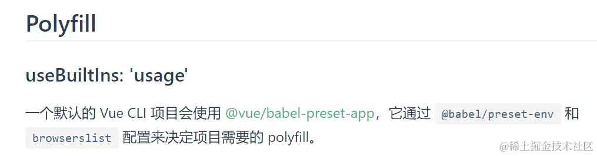

babel是什么？
=========

浏览器的发展跟不上语言的发展，es6+虽然很普及了，但也不是所有浏览器都可以支持es6+语法。babel的诞生就源于此。

babel只是提供了一个“平台”，让更多有能力的plugins入驻平台，是这些plugins提供了将 ES6+版本的代码转换为向后兼容的 JavaScript 语法的能力。

babel的编译流程
==========

主要分为三步，流程主要为：

**parsing（解析）、transforming（转化）、generating（生成）**

1.  parsing: `babylon`（babel 内部使用的解析类库叫做 `babylon`，现在改名叫`@babel/parser`） 负责将es6代码进行语法分析和词法分析后转换成抽象语法树AST
2.  transforming: plugin插件使用 `@babel/traverse` 来遍历 AST 并进行节点的操作，用它提供的 API 来编写对 AST 的遍历和修改逻辑，由此来将一种AST转换为另一种AST
3.  generating：`@babel/generator`负责通过AST树生成ES5代码

其中第二步的转化是重中之重，babel的插件机制也是在这一步发挥作用的，plugins在这里进行操作，转化成新的AST，再交给第三步的`@babel/generator`。 所以如果没有这些plugins进驻平台，那么babel这个“平台”是不具备任何能力的。

而这整个过程，由`@babel/core` 负责编译过程的控制和管理。它会调用其他模块来解析、转换和生成代码。

名词介绍
====

Plugins 和 Presets 的运行顺序

*   Plugins 在 Presets 前运行
*   Plugins 顺序从前往后排列
*   Presets 顺序是颠倒的（从后往前）

```
    {
      "plugins": ["Tom", "Jack"],
      "presets": ["a", "b", "c"]
    }

```

plugins运行顺序：`Tom`，`Jack`

presets运行顺序： `c` ， `b` ，然后 `a`

plugins：插件
----------

正确转化源码，必须使用对应的 plugins。Babel 推崇功能的单一性，就是每个插件的功能尽可能的单一。比如想使用 ES6 的箭头函数，需要插件`@babel/plugin-transform-arrow-functions`，但是ES6、ES7...那么多新语法难不成一个个装？这时候presets就来了

*   插件名可以缩写，把plugin省略：@babel/plugin-transform-runtime等价于@babel/transform-runtime

presets：预设
----------

presets就是plugins的集合，就比如`@babel/preset-env`这个预设，里面装了这么多的plugins


随便点一个plugin看看，可以看到这个plugin的全名叫`@babel/plugin-transform-arrow-functions`

可以单独直接下载这个包名：`pnpm i @babel/plugin-transform-arrow-functions -D`进行使用


*   预设名可以缩写，把preset省略：@babel/preset-env等价于@babel/env

polyfill：垫片
-----------

polyfill 在英文中有垫片的意思，意为兜底的东西。在计算机科学中，指的是对未能实现的客户端上进行的"兜底"操作。

Polyfill的准确意思为：垫平不同浏览器或者不同环境下的差异，让新的内置函数、实例方法等在低版本浏览器中也可以使用，原理是把它不支持的方法通过用支持的方法重写来获得支持

本文提到的polyfill，均是core-js这个库提供的，如promises 、symbols等等

安装
==

**以下用"进化"的方式来演示Babel配置是怎么一步步进化的，先安装等下用到的包**

pnpm i @babel/core @babel/cli @babel/preset-env @babel/plugin-transform-runtime regenerator-runtime @babel/polyfill -D

pnpm i core-js@3 @babel/runtime @babel/runtime-corejs3 -S

项目根目录新建文件：babel.config.json

```
    //babel.config.json
    {
      //先不写任何配置，看下babel在这种情况能干什么
      "presets": [],
      "plugins": []
    }

```

使用
==

举个例子，写段ES6+语法的代码，看看babel把ES6+的语法转成ES5要经历什么过程

建立两个文件，input.js用于准备ES6+的语法例子，output.js是babel的输出文件


用@babel/cli来运行babel命令，这个babel命令写成script放在package.json

```
    //意思是用babel来将babel目录下的input.js转成支持ES5语法，输出到babel目录下的output.js
    "babel": "babel babel/input.js --out-file babel/output.js"

```
```
    //测试文件，index.js
    const arrow = () => {
      console.log('测试箭头函数')
    }
    
    const p = new Promise((resolve, reject) => {
      resolve('测试Promise')
    })
    
    const list = [1, 2, 3, 4].map((item) => item * 2)

```

然后注意你的项目目录下有没有以下这种限定浏览器版本范围的文件，先删掉它，以免干扰babel判定支持的浏览器范围

*   项目根目录的 **.browserslistrc**文件
*   package.json的**browserslist**配置
*   babel.config.json配置中的**targets**选项

然后就可以用命令pnpm run babel来进行babel测试，得到结果：

```
    const arrow = () => {
      console.log('测试箭头函数');
    };
    const p = new Promise((resolve, reject) => {
      resolve('测试Promise');
    });
    const list = [1, 2, 3, 4].map(item => item * 2);

```

可以看到没有任何变化。箭头函数、promise还是原封不动

这就印证了前面说的：babel只是提供了一个**平台**，Babel 本身不具有任何转化功能，它把转化的功能都分解到一个个 plugin 里面。因此当我们不配置任何插件时，经过 babel 的代码和输入是相同的，现在加入plugins。

在加入plugins测试之前需要知道一些前置知识，babel将ES6+版本的代码分为了两种情况处理：

*   语法层： let、const、class、箭头函数等，这些需要在构建时进行转译，是指在语法层面上的转译
*   api方法层：Promise、includes、map等，这些是在全局或者Object、Array等的原型上新增的方法，**它们可以由相应es5的方式重新定义**

babel对这两种情况的转译是不一样的，接下来需要给出相应的配置

babel配置第一次进化
------------

上面的例子中const、箭头函数属于语法层面的，而promise和map属于api方法层面的，现在加入预设 **@babel/preset-env**看看效果

```
    //babel.config.json
    {
      //@babel/preset-env其实是有提供polyfills能力的，但是默认为关闭
      //这里先不开启，仅让它起到转化语法层面的能力
      "presets": ["@babel/preset-env"],
      "plugins": []
    }

```

再次跑一下babel命令，得到结果：

```
    "use strict";
    
    var arrow = function arrow() {
      console.log('测试箭头函数');
    };
    var p = new Promise(function (resolve, reject) {
      resolve('测试Promise');
    });
    var list = [1, 2, 3, 4].map(function (item) {
      return item * 2;
    });

```

发现语法层面的代码都降级了。那么api层面要如何处理呢？ 下面有请 `@babel/polyfill`（这东西现在已经被弃用了，但是现在按照历史进度来讲解它曾经的辉煌）的加入，

在测试代码中导入它：

```
    import '@babel/polyfill'
    const arrow = () => {
      console.log('测试箭头函数')
    }
    
    const p = new Promise((resolve, reject) => {
      resolve('测试Promise')
    })
    
    const list = [1, 2, 3, 4].map((item) => item * 2)

```

再跑一下babel看下结果：

```
    "use strict";

    require("@babel/polyfill");
    var arrow = function arrow() {
      console.log('测试箭头函数');
    };
    var p = new Promise(function (resolve, reject) {
      resolve('测试Promise');
    });
    var list = [1, 2, 3, 4].map(function (item) {
      return item * 2;
    });

```

就多了一行**require("@babel/polyfill")** ，但是已经包含了整个ES6+环境所需要的API了，会变得臃肿，所以有进化的空间

babel配置第二次进化
------------

上面通过 `import "@babel/polyfill"` 的方式来实现针对api层面的“无脑解决”。然而从 babel 7.4.0版本开始就不建议采取这样的方式了。 因为引入 @babel/polyfill 就相当于在代码中引入下面两个库

```
import "core-js/stable";
import "regenerator-runtime/runtime";

```

这意味着不仅不能按需加载还有全局变量被污染的问题（因为他是通过向全局对象和内置对象的prototype上添加方法来实现的）

因此 babel 决定把这两个家伙的工作一并交给上面提到的 **@babel/preset-env**，即通过设置useBuiltIns的方式来提供polyfill的能力，且支持按需加载

```
    //babel.config.json
    {
      "presets": [
        [
          "@babel/preset-env",
          {
            // 实现按需加载
            "useBuiltIns": "usage", 
            "corejs": {
              "version": 3
            }
          }
        ]
      ],
      "plugins": []
    }

```
```
    //input.js
    //不用导入任何文件，因为这里使用usage，原因后面useBuiltIns配置项有解析
    const arrow = () => {
      console.log('测试箭头函数')
    }

    const p = new Promise((resolve, reject) => {
      resolve('测试Promise')
    })

    const list = [1, 2, 3, 4].map((item) => item * 2)

```

再看一下结果：

```
    "use strict";

    require("core-js/modules/es.object.to-string.js");
    require("core-js/modules/es.promise.js");
    require("core-js/modules/es.array.map.js");
    var arrow = function arrow() {
      console.log('测试箭头函数');
    };
    var p = new Promise(function (resolve, reject) {
      resolve('测试Promise');
    });
    var list = [1, 2, 3, 4].map(function (item) {
      return item * 2;
    });

```

可以看到只require了需要的方法，压力确实小多了。

但是我想得寸进尺，请问还能不能再进化一下？

babel配置第三次进化
------------

这次进化需要改一下样例代码来说明，换个使用场景，let、const这些对比不出问题，所以用class

```
    // input.js
    class Person {
      constructor(name) {
        this.name = name;
      }
      say() {
        console.log(this.name);
      }
    }

```

看下babel转化结果：


除了require的部分，还多了好多定义的函数，这些是辅助函数（比如上边的\_classCallCheck函数），是在编译阶段辅助 Babel 的函数；问题来了，现在只有一个JS文件需要转换，然而实际项目开发中会有大量的需要转换的文件，如果每一个转换后的文件中都存在相同的函数，那代码总体积肯定会无意义的增大。所以有没有哪位英雄可以抽离出来复用以减少空间？

`@babel/plugin-transform-runtime`就可以做到

该插件会开启对 Babel 注入的辅助函数的复用，以节省代码体积，这些辅助函数被统一隔离在`@babel/runtime`中提供的helper模块中，编译时，直接从helper模块加载

所以还需要安装`@babel/runtime`（在对一些语法进行编译的时候，babel需要借助一些辅助函数）

`@babel/plugin-transform-runtime` 通常仅在开发时使用，但是运行时最终代码需要依赖 `@babel/runtime`，所以 `@babel/runtime` 必须要作为生产依赖被安装

```
    // babel.config.json
    {
      "presets": [ "@babel/preset-env"],
      // 注意，runtime没有设置core-js的话，默认是false,即不提供polyfill，现在这个class Person例子没关系，因为没用到Promise那些
      "plugins": ["@babel/plugin-transform-runtime"]
    }

```

注意：如果使用`@babel/plugin-transform-runtime`，则不得设置`@babel/preset-env`的`useBuiltIns`

官网警告：


再次babel的结果：


未使用`@babel/plugin-transform-runtime`之前打包的JS文件大小：（用的其他项目代码打包举例）


使用之后（`@babel/plugin-transform-runtime`用到版本**core-js：2**）：


OK，解决了代码冗余的问题，打包也更小了，但是前面使用 `useBuiltIns` 配置项实现了polyfill的按需引用，也带来了全局变量污染的情况，就比如更前面一点的输出结果中有这句代码，重写了array的prototype方法，造成了全局污染：

```
    require("core-js/modules/es.array.map.js");

```

解决方式就是：将core-js（也就是提供polyfill的能力）交给`@babel/plugin-transform-runtime`处理

babel配置终极进化
-----------

终极进化意思不是每个项目都应该无脑复制粘贴这个配置，像Vue、React等等框架的作者早已考虑到这点，会在此基础上作了封装、改进优化等等，以更好适配他们自己的JS框架

```
    //babel.config.json
    {
      "presets": ["@babel/preset-env"],
      "plugins": [
        [
          "@babel/plugin-transform-runtime",
          {
            // 不同版本区别后面会说
            "corejs": { "version": 3 }
          }
        ]
      ]
    }

```

测试代码babel处理结果（用回了第一个测试用测代码）：


可以看到，这回代码里面不会直接require了，都是变量，无全局污染

这个babel配置下的打包大小：（用的其他项目代码打包举例，用到版本**core-js：3**）


怎么大了一点？上一节的截图打包大小不是89.3KB吗？因为前面是**core-js：2**，从2升到3，corejs提供的polyfill会有些细微的升级、变化，并非是导入了项目中用不到的polyfill

综上所述，`@babel/plugin-transform-runtime`实现了下面几个重要的功能

*   对辅助函数的复用，解决代码冗余问题
*   解决全局变量污染问题
*   提供polyfill，并且是根据代码使用情况导入+目标浏览器来提供，相当于`@babel/preset-env`中的"useBuiltIns": "usage"【后面的`@babel/plugin-transform-runtime`章节会验证】

全局变量污染
------

关于这个全局变量污染，官网解释其影响和后果：


这里试验一下怎么个污染法，先是不用`@babel/plugin-transform-runtime`的情况：

IE 11不支持`String.prototype.includes`，拿它来试验下，在F12控制台试着用`includes`方法，结果正常输出，说明全局变量被更改了


然后是用了之后的情况，项目代码正常输出，但是在控制台输出不行，做到了防止全局变量污染：


babel-cli
=========

Babel附带了一个内置的CLI，可用于从命令行编译文件。

安装

```
pnpm i @babel/core @babel/cli -D

```

这将把编译后的结果直接输出至终端。使用 `--out-file` 或着 `-o` 可以将结果写入到指定的文件。.

```
babel example.js --out-file compiled.js
//或者缩写
babel example.js -o compiled.js

```

如果我们想要把一个目录的文件全都编译成一个新的目录，可以使用 `--out-dir` 或者 `-d`。.

```
babel src --out-dir lib
//或者缩写
babel src -d lib

```

@babel/preset-env
=================

可以理解为一个进化的完全体，涵盖了以下预设


useBuiltIns选项
-------------

如果用了插件`@babel/plugin-transform-runtime`，就不能设置这个选项

```
  "presets": [
    [
      "@babel/preset-env",
      //配置样例
      {
        "useBuiltIns": "usage",
        "corejs": { "version": 3 }
      }
    ]
  ]

```

这个配置提供了三个选项告诉`babel`该如何引入`polyfill`包

#### usage

**代码中不用主动`import`**，需要指定corejs版本

用usage选项的话`babel`会自动将有以下特征的`polyfill`导入

*   `browserslist`环境（目标浏览器）不支持的
*   代码里已使用到的

#### entry

**代码中需要主动`import 'core-js/stable'`** ，需要指定corejs版本

并且如果在使用`7.18.0` 版本以下的 `@babel/core`，还需要额外再引入一个包，安装：

npm i regenerator-runtime -D

引入：**`import 'regenerator-runtime/runtime'`**

用entry选项的话`babel`会自动将有以下特征的`polyfill`导入

*   `browserslist`环境（目标浏览器）不支持的

**打包大小对比**

usage和entry打包JS文件大小对比（用的其他项目代码举例，`@babel/core`为^7.22）：

usage：


entry（不导入core-js/stable，页面显示异常）：


我故意先不导入`core-js/stable`，可以看到大小比usage小，这是因为entry不会根据代码使用情况去导入polyfill，而polyfill都在`core-js/stable`里面，我不导入它的话自然更小，页面也不会正常显示：


entry（导入core-js/stable，页面显示正常）：


这里打包大小是usage的两倍，这是因为entry下即便是项目并不会用到的polyfill，它也给打包进去了

#### false（默认选项）

只做了语法转换，不会导入任何`polyfill`进来，并且`corejs`配置将无效

按照上面的解释，那usage岂不是吊打entry？并不是，因为一些第三方库或框架可能依赖于特定的 polyfill，这些 polyfill 可能无法通过 `usage` 自动导入

corejs选项
--------

Type: `string` 或 `{ version: string, proposals: boolean }` ，默认为 `"2.0"` 。 `version` 字符串可以是任何支持的 `core-js` 版本。例如 `"3.8"` 或 `"2.0"` 。

此选项仅在与 `useBuiltIns: usage` 或 `useBuiltIns: entry` 一起使用时才有效

```
    "corejs":"3"
    //等价于
    "corejs":"3.0"

```

所以有需求的话建议指定子版本号

proposals的意思是还在提案中，但是还没有正式发布的语法，设为true即可使用这些语法

targets选项
---------

Type: `string | Array<string> | { [string]: string }`

默认值： `{}`。未指定目标时：Babel会假设你的目标是尽可能的最老的浏览器

```
    //这里先不用终极进化版配置，用@babel/preset-env举例，因为@babel/preset-env可以配置targets
    //而@babel/plugin-transform-runtime目前不支持
    "presets": [
        [
          "@babel/preset-env",
          {
            "useBuiltIns": "usage",
            "corejs": { "version": 3 },
            //指定浏览器范围为：基于全球使用率大于0.25%的浏览器版本范围  
            //2年内仍有官方支持或更新的浏览器（兼容IE就把not dead去掉）
            "targets": ["> 0.25%","not dead"]
          }
        ]
      ]

```

这个配置下，用babel处理前面的样例代码的运行结果是：

```
    'use strict'

    const arrow = () => {
      console.log('测试箭头函数')
    }
    const p = new Promise((resolve, reject) => {
      resolve('测试Promise')
    })
    const list = [1, 2, 3, 4].map((item) => item * 2)

```

可以看到它没有进行任何处理，像是箭头函数、promise等等都原封不动。这是因为targets上面指定了为not dead状态的浏览器，即主流浏览器。而这些浏览器本身就是支持较新语法的。但如果把not dead去掉，结果是：

```
    'use strict'

    require('core-js/modules/es.object.to-string.js')
    require('core-js/modules/es.promise.js')
    require('core-js/modules/es.array.map.js')
    let arrow = function arrow() {
      console.log('测试箭头函数')
    }
    let p = new Promise(function (resolve, reject) {
      resolve('测试Promise')
    })
    let list = [1, 2, 3, 4].map(function (item) {
      return item * 2
    })

```

可以看到为了照顾**老弱病残浏览器**，require了相应的 polyfill 去让这些浏览器能够正常运行代码

查浏览器状态、某版本人群使用覆盖率、更多语法网站：[browsersl.ist/](https://link.juejin.cn/?target=https%3A%2F%2Fbrowsersl.ist%2F "https://browsersl.ist/")

例如查哪些浏览器是dead状态的：


可以看到dead状态的浏览器，全球还有0.62%的人们在使用

IE浏览器11版本，全球范围还有0.4%的人在用

@babel/plugin-transform-runtime
===============================

一般就只需要配置corejs就行，其他配置不常用，且不少配置项都废弃了：[babel.dev/docs/babel-…](https://link.juejin.cn/?target=https%3A%2F%2Fbabel.dev%2Fdocs%2Fbabel-plugin-transform-runtime "https://babel.dev/docs/babel-plugin-transform-runtime")

corejs
------

可选值：`false`、`2`、`3`， 默认是`false`

选择不同的值，安装的包也不一样

| `corejs` 选项 | 安装命令                                    |
| ------------- | ------------------------------------------- |
| `false`       | `npm install --save @babel/runtime`         |
| `2`           | `npm install --save @babel/runtime-corejs2` |
| `3`           | `npm install --save @babel/runtime-corejs3` |

注意：有些函数只有3才会有：


官网介绍：[babel.dev/docs/babel-…](https://link.juejin.cn/?target=https%3A%2F%2Fbabel.dev%2Fdocs%2Fbabel-plugin-transform-runtime%23corejs "https://babel.dev/docs/babel-plugin-transform-runtime#corejs")

验证导入polyfill
------------

`@babel/plugin-transform-runtime`是根据项目代码使用情况自动导入polyfill，还是根据corejs选择的值全部导入？比如`corejs: 2`不支持`[].includes`，3才支持，是不是意味着我用了`corejs: 3`之后，即使我项目用不到，它也给我导入polyfill来支持`[].includes`？

现在试验下，环境为 webpack5 + vue2，使用babel配置为：

```
    {
      "presets": ["@babel/preset-env"],
      "plugins": [
        [
          "@babel/plugin-transform-runtime",
          {
            "corejs": { "version": 3 }
          }
        ]
      ]
    }

```

package.json中设置目标浏览器范围，意思是兼容ie 11：

```
    "browserslist": ["ie 11"]

```

项目代码写个函数，内容什么都不干

```
    export default {
      methods: {
        test() {
        },
      },
    };

```

这时打包的JS内容中，搜索`includes`：


结果并没有来源于corejs提供的有关于`includes`的东西，然后再试下在项目中使用`includes`：

```
    export default {
      methods: {
        test() {
          console.log('hello'.includes('h'));
        },
      },
    };

```

结果打包的文件中就出现了关于`includes`的polyfill：


再验证下会不会根据`browserslist`动态判断是否应该导入polyfill，改成比较新的浏览器来比较：

```
    "browserslist": ["chrome 110"]

```

打包结果为：


可以看到是直接原封不动输出了，因为目标浏览器兼容性好，支持`includes`

综上所述，该Babel配置下对polyfill的导入效果约等于`@babel/preset-env`中的`"useBuiltIns": "usage"`

项目使用
====

学完了这么多基础知识，现在把它运用到项目上，这里三种脚手架都说下

webpack
-------

**不需要babel.config.json等babel配置文件**

需要babel-loader配合：[github.com/babel/babel…](https://link.juejin.cn/?target=https%3A%2F%2Fgithub.com%2Fbabel%2Fbabel-loader "https://github.com/babel/babel-loader")

安装：

npm i babel-loader @babel/core @babel/preset-env @babel/plugin-transform-runtime -D

npm i @babel/runtime-corejs3 -S

配置：

```
module.exports = {
  // ..其他配置略
  // 构建目标：Webpack将生成web平台的运行时代码，并且只使用ES5相关的特性
  target: ['web', 'es5'],
  module: {
    rules: [
      {
        test: /\.js$/,
        exclude: /node_modules/,
        use: {
          loader: 'babel-loader',
          options: {
            presets: ['@babel/preset-env'],
            plugins: [
              [
                '@babel/plugin-transform-runtime',
                {
                  corejs: { version: 3 },
                },
              ],
            ],
          },
        },
      },
    ],
  },
};

```

Vue CLI
-------

**需要babel.config.json等babel配置文件**

一句话概括：

尤雨溪写Vue的时候已经考虑过这点了，现在直接给我们一个默认**套餐**：`@vue/cli-plugin-babel/preset`。

但是这个套餐的由来需要经过几周波折，又要讲解历史了：

[cli.vuejs.org/zh/config/#…](https://link.juejin.cn/?target=https%3A%2F%2Fcli.vuejs.org%2Fzh%2Fconfig%2F%23babel "https://cli.vuejs.org/zh/config/#babel")

*   官方先是提到建议使用 **@vue/babel-preset-app**：


*   同时**浏览器兼容性**这一章节也提到了这个预设包的useBuiltIns被默认设置为usage，也就是自动检测需要的 polyfill



但其实这个`@vue/babel-preset-app`到后面又被集成到了`@vue/cli-plugin-babel`


**“涵盖了Babel 7 + babel-loader + @vue/babel-preset-app”**

这就是为什么现在用@vue/cli（4.0+版本）创建的项目会发现默认装有 **@vue/cli-plugin-babel**，其默认的babel配置文件：

```
    //babel.config.js
    module.exports = {
      presets: ["@vue/cli-plugin-babel/preset"],
    };

```

### 试试删掉这个preset，跑在IE11上会怎么样

应该会表现的不兼容，毕竟删掉了之后别说API层（promise等）的转换没了，语法层（箭头函数等）的转换也没了，但是眼见为实还是得测试下

写个箭头函数，删掉preset之前正常运行：


删掉preset之后，不认识箭头函数了：


### 默认配置够用吗？能否改进

官网给出建议：


配置文件：

```
    //babel.config.js
    module.exports = {
      presets: [
        [
          "@vue/cli-plugin-babel/preset",
          {
            useBuiltIns: "entry",
          },
        ],
      ],
    };

```

如果发现仍有未转译的代码，可以配置vue.config.js中配置transpileDependencies，详情：[cli.vuejs.org/zh/config/#…](https://link.juejin.cn/?target=https%3A%2F%2Fcli.vuejs.org%2Fzh%2Fconfig%2F%23transpiledependencies "https://cli.vuejs.org/zh/config/#transpiledependencies")

### 新旧版本Vue CLI的babel默认配置

@vue/cli 3.X版本创建项目默认用的babel.config.js是

```
    module.exports = {
      presets: [
        //@vue/babel-preset-app的缩写
        '@vue/app'
      ]
    }

```

@vue/cli 4.X以后的版本（目前最新5.0.8）创建项目默认用的babel.config.js是

```
    module.exports = {
      presets: [
        '@vue/cli-plugin-babel/preset'
      ]
    }

```

vite
----

**不需要babel.config.json等babel配置文件**

这个作者也给了默认**套餐**：`@vitejs/plugin-legacy`


```
// vite.config.js
import legacyPlugin from '@vitejs/plugin-legacy'
export default defineConfig( {
    plugins: [
        legacyPlugin({
            // 如果不设置targets，默认值为'last 2 versions and not dead, > 0.3%, Firefox ESR'
            // 需要兼容的目标列表，可以设置多个
            targets:['chrome 52'],  
        })
    ]
})

```

该插件更详细的选项配置：[github.com/vitejs/vite…](https://link.juejin.cn/?target=https%3A%2F%2Fgithub.com%2Fvitejs%2Fvite%2Ftree%2Fmain%2Fpackages%2Fplugin-legacy "https://github.com/vitejs/vite/tree/main/packages/plugin-legacy")

### 针对IE11问题

总结：`@vitejs/plugin-legacy`不能使Vue3支持IE11，只能改Vue2

在网上搜这个问题，可能会有些文章说官网给出了这样的配置`additionalLegacyPolyfills: ['regenerator-runtime/runtime']`，说可以兼容IE11


然而这段话早在22年5月就被删除了


那为什么官网会曾经写过这么一段介绍？因为别的框架（React等）是有可能通过@vitejs/plugin-legacy支持ie11的（vite不是vue专用，别搞混了），只是vue3的proxy不能支持


其实Vue3与IE11的问题尤雨溪早已在rfcs（普通开发者为vue提出建议改进的地方）正面给出答案：[github.com/vuejs/rfcs/…](https://link.juejin.cn/?target=https%3A%2F%2Fgithub.com%2Fvuejs%2Frfcs%2Fblob%2Fmaster%2Factive-rfcs%2F0038-vue3-ie11-support.md "https://github.com/vuejs/rfcs/blob/master/active-rfcs/0038-vue3-ie11-support.md")

文章总结就是尤雨溪认为让Vue3支持IE11的成本太高，不值得，真想用IE11直接用Vue2开发就得了

### 测试插件提供的polyfill是否生效

这里选择测试Promise，随便选个浏览器版本，[caniuse.com](https://link.juejin.cn/?target=https%3A%2F%2Fcaniuse.com "https://caniuse.com") 显示火狐25版本不支持，那就用它测试：


没用`@vitejs/plugin-legacy`的结果，一片空白，无法正常显示


用上`@vitejs/plugin-legacy`之后：


参考文章
====

[zhuanlan.zhihu.com/p/129089156](https://link.juejin.cn/?target=https%3A%2F%2Fzhuanlan.zhihu.com%2Fp%2F129089156 "https://zhuanlan.zhihu.com/p/129089156")

[juejin.cn/post/684516…](https://juejin.cn/post/6845166891015602190 "https://juejin.cn/post/6845166891015602190")

[juejin.cn/post/684490…](https://juejin.cn/post/6844904199554072583 "https://juejin.cn/post/6844904199554072583")

本文仅代表个人观点，可能存在不准确或不完整之处，欢迎各位读者批评指正

  

本文转自 [https://juejin.cn/post/7284144079716728873](https://juejin.cn/post/7284144079716728873)，如有侵权，请联系删除。