### 前期准备

1.租用云主机（centos)

2.云主机上安装docker，docker-compose

### docker安装portainer

docker-compose.yml

```
docker-compose up -d
```


```
version: "3"
services:
  portainer:
    image: portainer/portainer-ce:latest
    container_name: portainer
    ports:
      - "9000:9000"
    volumes:
      - /home/app/portainer/data:/data
      - /var/run/docker.sock:/var/run/docker.sock
```

### 申请阿里云镜像服务创建个人版实例

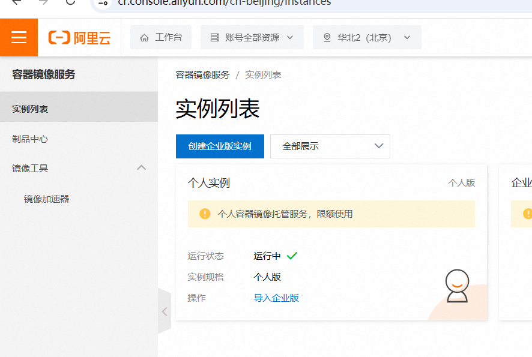

### 进入实例创建命名空间

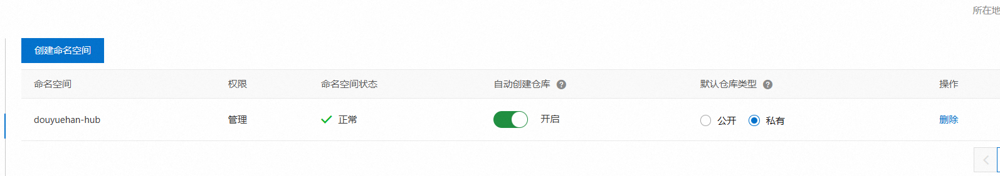

### springboot项目使用jib-maven-plugin插件打包镜像并推送到阿里云镜像仓库

```
<project xmlns="http://maven.apache.org/POM/4.0.0" xmlns:xsi="http://www.w3.org/2001/XMLSchema-instance"
         xsi:schemaLocation="http://maven.apache.org/POM/4.0.0 http://maven.apache.org/xsd/maven-4.0.0.xsd">
    <modelVersion>4.0.0</modelVersion>

    <groupId>org.example</groupId>
    <artifactId>hellobootdocker_xxx</artifactId>
    <version>1.0-SNAPSHOT</version>
    <packaging>jar</packaging>

    <name>hellobootdocker</name>
    <url>http://maven.apache.org</url>
    <parent>
        <groupId>org.springframework.boot</groupId>
        <artifactId>spring-boot-starter-parent</artifactId>
        <version>2.5.8</version>
    </parent>
    <properties>
        <project.build.sourceEncoding>UTF-8</project.build.sourceEncoding>
    </properties>

    <dependencies>
        <dependency>
            <groupId>org.springframework.boot</groupId>
            <artifactId>spring-boot-starter-web</artifactId>
        </dependency>
        <dependency>
            <groupId>junit</groupId>
            <artifactId>junit</artifactId>
            <version>3.8.1</version>
            <scope>test</scope>
        </dependency>
    </dependencies>
    <build>
        <plugins>
            <plugin>
                <groupId>org.springframework.boot</groupId>
                <artifactId>spring-boot-maven-plugin</artifactId>
                <executions>
                    <execution>
                        <goals>
                            <goal>repackage</goal>
                        </goals>
                    </execution>
                </executions>
            </plugin>
            <plugin>
                <groupId>com.google.cloud.tools</groupId>
                <artifactId>jib-maven-plugin</artifactId>
                <version>3.2.0</version>
                <configuration>
                    <!-- 拉取所需的基础镜像 - 这里用于运行springboot项目 -->
                    <from>
                        <image>registry.cn-hangzhou.aliyuncs.com/douyuehan-hub/java8:v8</image>
                        <auth>
                            <!--在私有镜像仓库上的账号和密码-->
                            <username>sphexc@gmail.com</username>
                            <password>kamibaxxxxxx</password>
                        </auth>
                    </from>
                    <!-- 最后生成的镜像配置 -->
                    <to>
                        <!-- push到私有镜像仓库 -->
                        <image>registry.cn-beijing.aliyuncs.com/douyuehan-hub/${project.artifactId}</image>
                        <!-- 镜像版本号 -->
                        <tags>
                            <tag>V3</tag>
                        </tags>
                        <auth>
                            <!--在私有镜像仓库上的账号和密码-->
                            <username>sphexc@gmail.com</username>
                            <password>kamibaxxxxxx</password>
                        </auth>
                    </to>
                    <container>
                        <mainClass>org.example.App</mainClass>
                        <ports>
                            <!--指定镜像端口 , 这里没用 docfile的操作-->
                            <port>8881</port>
                        </ports>
                    </container>
                </configuration>
                <executions>
                    <execution>
                        <phase>package</phase>
                        <goals>
                            <goal>build</goal>
                        </goals>
                    </execution>
                </executions>
            </plugin>
        </plugins>
        <finalName>${project.artifactId}</finalName>
    </build>
</project>


```

1.这里使用阿里云镜像仓库中的java8基础镜像仓库，是使用docker从docker中心仓库pull下来后，push到阿里云的。这样做的目的是加快springboot项目镜像构建速度，因为从阿里云拉取，比docker中心仓库要快。

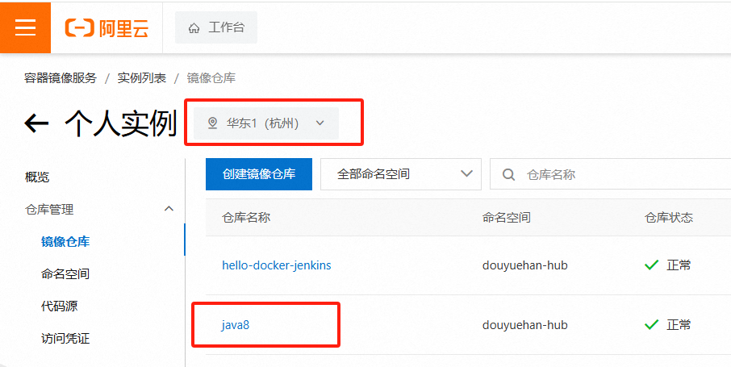

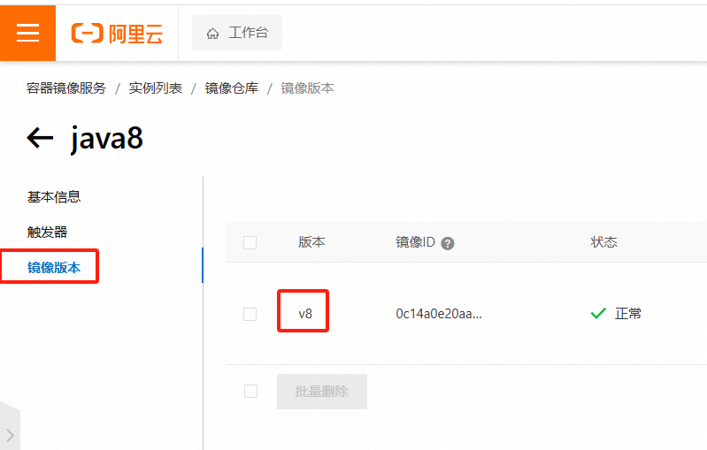


2.push插件打包后的镜像到阿里云镜像仓库，这里要注意镜像名和镜像版本号（tag），以及阿里云镜像仓库所在的区

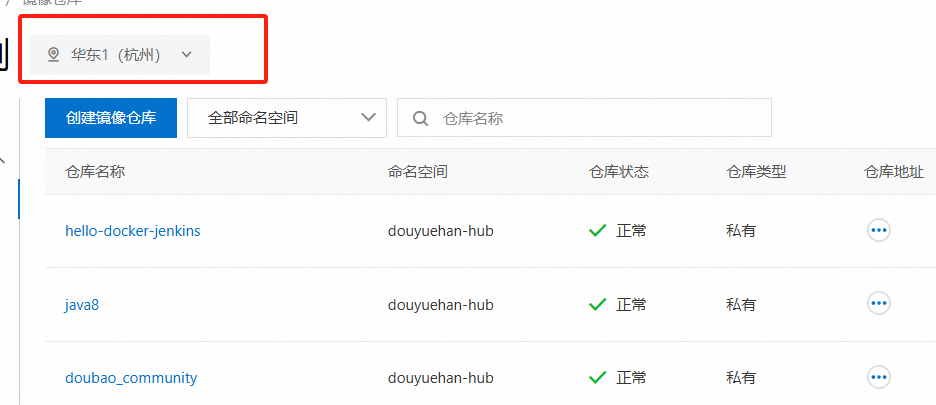

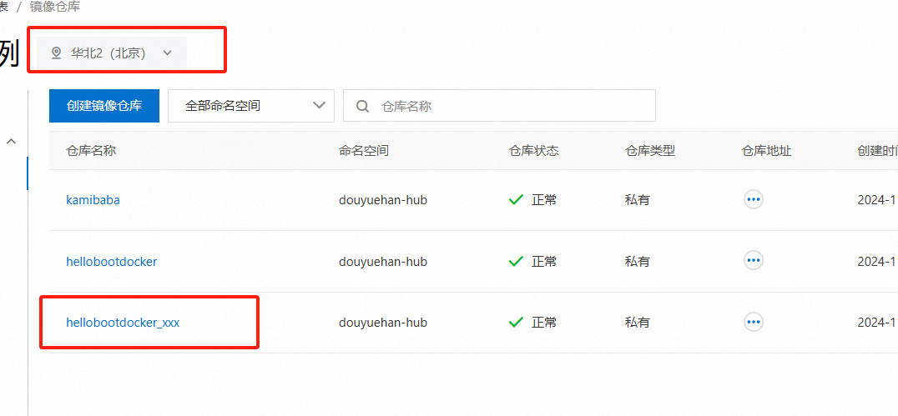

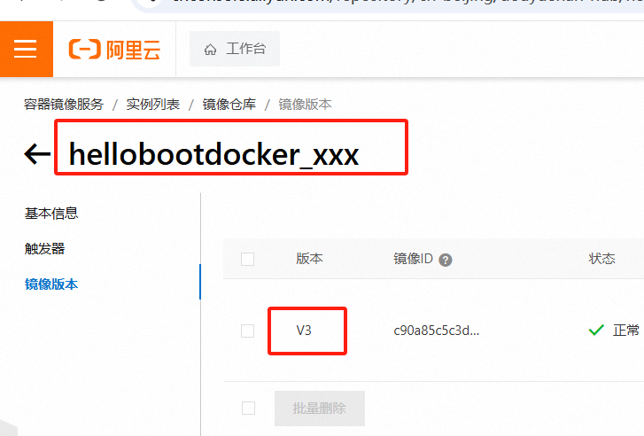

### portainer新增阿里云Registry

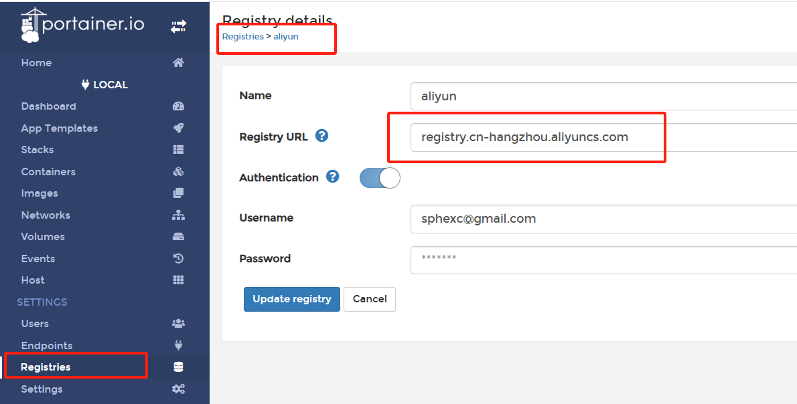

### portainer拉取springboot镜像

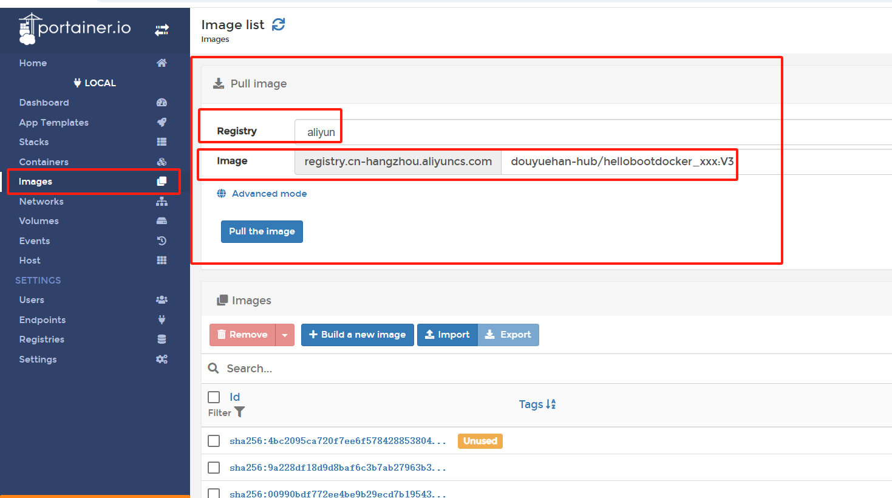

### portainer新建stack，创建docker-compose.yml运行springboot+mysql容器

redis-network的作用是将springboot项目和mysql放到同一个局域网，使得可以相互访问

```
version: '3'
services:
  walletc:
    image: registry.cn-hangzhou.aliyuncs.com/douyuehan-hub/hellobootdocker_xxx:V3
    container_name: novel-service
    restart: always
    ports:
      - 8882:8882
    environment:
      - TZ=Asia/Hong_Kong
    volumes:
      - /etc/localtime:/etc/localtime:ro
    networks:
      - redis-network
  mysql:
    container_name: mysql
    image: mysql:5.7
    environment: 
      MYSQL_ROOT_PASSWORD: root 
      MYSQL_USER: zs
      MYSQL_PASS: zs
      LANG: "C.UTF-8"
    restart: always
    volumes: 
      - "./data/db:/var/lib/mysql"  
      - "./data/conf/my.cnf:/etc/mysql/my.cnf"
    ports:
      - 3306:3306
    networks:
      - redis-network
networks:
  redis-network:
    driver: bridge
```

### 腾讯云防火墙放行相关端口

### navicat连接到docker容器里的mysql，导入sql脚本

## vue前端项目部署

### build

```
pnpm run build
```

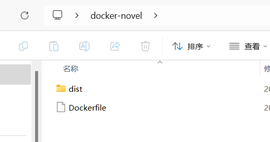

### ### 编写Dockerfile

```
#Dockerfile
 
FROM nginx:1.21.0-alpine
LABEL Author dzh
COPY dist /usr/share/nginx/html
```

### 上传docker-novel目录到云主机

### xshell登录云主机，进入novel-front目录

运行

```
docker image build -t novel-front:v07 .
```

生成novel-front前端项目镜像。

### push镜像到阿里云镜像仓库

```
docker login --username=sphexc@gmail.com registry.cn-hangzhou.aliyuncs.com
输入密码 kamibaxxxxxx

```

### 查看前端镜像id，假设是489a，给本地镜像打个标签registry.cn-hangzhou.aliyuncs.com/douyuehan-hub/novel_front:v07，然后推送本地镜像到远程阿里云仓库

```
docker tag 489a registry.cn-hangzhou.aliyuncs.com/douyuehan-hub/novel_front:v07
docker push registry.cn-hangzhou.aliyuncs.com/douyuehan-hub/novel_front:v07
```

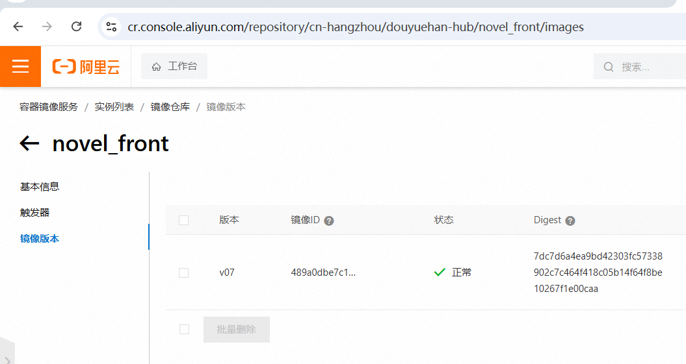

### portainer拉取前端镜像

### portainer新建stack，编写docker-compose.yml

```
version: '3'
services:
  doubao:
    image: registry.cn-hangzhou.aliyuncs.com/douyuehan-hub/novel_front:v07
    container_name: novel-client
    restart: always
    ports:
      - 8883:80

```

