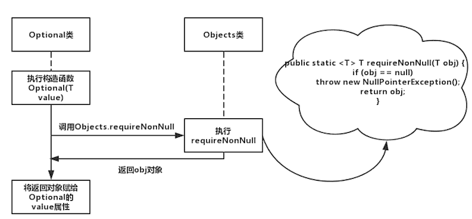

 

引言

在文章的开头，先说下NPE问题，NPE问题就是，我们在开发中经常碰到的NullPointerException.假设我们有两个类，他们的UML类图如下图所示

[](http://www.ibloger.net/zb_users/upload/2018/06/201806161529155706180997.png)

在这种情况下，有如下代码

```
user.getAddress().getProvince();
```

这种写法，在user为null时，是有可能报NullPointerException异常的。为了解决这个问题，于是采用下面的写法

```
if(user!=null){
    Address address = user.getAddress();
    if(address!=null){
        String province = address.getProvince();
    }
}
```

这种写法是比较丑陋的，为了避免上述丑陋的写法，让丑陋的设计变得优雅。JAVA8提供了Optional类来优化这种写法，接下来的正文部分进行详细说明

#### API介绍

先介绍一下API，与其他文章不同的是，本文采取类比的方式来讲，同时结合源码。而不像其他文章一样，一个个API罗列出来，让人找不到重点。

1、Optional(T value),empty(),of(T value),ofNullable(T value)

这四个函数之间具有相关性，因此放在一组进行记忆。

先说明一下，`Optional(T value)`，即构造函数，它是private权限的，不能由外部调用的。其余三个函数是public权限，供我们所调用。那么，Optional的本质，就是内部储存了一个真实的值，在构造的时候，就直接判断其值是否为空。好吧，这么说还是比较抽象。直接上`Optional(T value)`构造函数的源码，如下图所示

[](http://www.ibloger.net/zb_users/upload/2018/06/201806161529155719187498.png)

那么，**of(T value)**的源码如下

```
public static <T> Optional<T> of(T value) {
    return new Optional<>(value);
}
```

也就是说of(T value)函数内部调用了构造函数。根据构造函数的源码我们可以得出两个结论:

*   通过`of(T value)`函数所构造出的Optional对象，当Value值为空时，依然会报NullPointerException。
    
*   通过`of(T value)`函数所构造出的Optional对象，当Value值不为空时，能正常构造Optional对象。
    

除此之外呢，Optional类内部还维护一个value为null的对象，大概就是长下面这样的

```
public final class Optional<T> {
    //省略....
    private static final Optional<?> EMPTY = new Optional<>();
    private Optional() {
        this.value = null;
    }
    //省略...
    public static<T> Optional<T> empty() {
        @SuppressWarnings("unchecked")
        Optional<T> t = (Optional<T>) EMPTY;
        return t;
    }
}
```

那么，`empty（）`的作用就是返回EMPTY对象。

好了铺垫了这么多，可以说`ofNullable(T value)`的作用了，上源码

```
 public static <T> Optional<T> ofNullable(T value) {
    return value == null ? empty() : of(value);
}
```

好吧，大家应该都看得懂什么意思了。相比较`of(T value)`的区别就是，当value值为null时，of(T value)会报NullPointerException异常；`ofNullable(T value)`不会throw Exception，`ofNullable(T value)`直接返回一个`EMPTY`对象。

那是不是意味着，我们在项目中只用`ofNullable`函数而不用of函数呢?

不是的，一个东西存在那么自然有存在的价值。当我们在运行过程中，不想隐藏`NullPointerException`。而是要立即报告，这种情况下就用Of函数。但是不得不承认，这样的场景真的很少。博主也仅在写junit测试用例中用到过此函数。

2、orElse(T other)，orElseGet(Supplier<? extends T> other)和orElseThrow(Supplier<? extends X> exceptionSupplier)

这三个函数放一组进行记忆，都是在构造函数传入的value值为null时，进行调用的。`orElse`和`orElseGet`的用法如下所示，相当于value值为null时，给予一个默认值:

```
@Test
public void test() {
    User user = null;
    user = Optional.ofNullable(user).orElse(createUser());
    user = Optional.ofNullable(user).orElseGet(() -> createUser());
    
}
public User createUser(){
    User user = new User();
    user.setName("zhangsan");
    return user;
}
```

这两个函数的区别：当user值不为null时，`orElse`函数依然会执行createUser()方法，而`orElseGet`函数并不会执行createUser()方法，大家可自行测试。

至于orElseThrow，就是value值为null时,直接抛一个异常出去，用法如下所示

```
User user = null;
Optional.ofNullable(user).orElseThrow(()->new Exception("用户不存在"));
```

3、map(Function<? super T, ? extends U> mapper)和flatMap(Function<? super T, Optional<U>> mapper)

这两个函数放在一组记忆，这两个函数做的是转换值的操作。

直接上源码

```
 public final class Optional<T> {
    //省略....
     public<U> Optional<U> map(Function<? super T, ? extends U> mapper) {
        Objects.requireNonNull(mapper);
        if (!isPresent())
            return empty();
        else {
            return Optional.ofNullable(mapper.apply(value));
        }
    }
    //省略...
     public<U> Optional<U> flatMap(Function<? super T, Optional<U>> mapper) {
        Objects.requireNonNull(mapper);
        if (!isPresent())
            return empty();
        else {
            return Objects.requireNonNull(mapper.apply(value));
        }
    }
}
```

这两个函数，在函数体上没什么区别。唯一区别的就是入参，map函数所接受的入参类型为`Function<? super T, ? extends U>`，而flapMap的入参类型为`Function<? super T, Optional<U>>`。

在具体用法上，对于map而言：

如果User结构是下面这样的

```
public class User {
    private String name;
    public String getName() {
        return name;
    }
}
```

这时候取name的写法如下所示

```
String city = Optional.ofNullable(user).map(u-> u.getName()).get();
```

对于flatMap而言:

如果User结构是下面这样的

```
public class User {
    private String name;
    public Optional<String> getName() {
        return Optional.ofNullable(name);
    }
}
```

这时候取name的写法如下所示

```
String city = Optional.ofNullable(user).flatMap(u-> u.getName()).get();
```

4、isPresent()和ifPresent(Consumer<? super T> consumer)

这两个函数放在一起记忆，`isPresent`即判断value值是否为空，而`ifPresent`就是在value值不为空时，做一些操作。这两个函数的源码如下

```
public final class Optional<T> {
    //省略....
    public boolean isPresent() {
        return value != null;
    }
    //省略...
    public void ifPresent(Consumer<? super T> consumer) {
        if (value != null)
            consumer.accept(value);
    }
}
```

需要额外说明的是，大家千万不要把

```
if (user != null){
   // TODO: do something
}
```

给写成

```
User user = Optional.ofNullable(user);
if (Optional.isPresent()){
   // TODO: do something
}
```

因为这样写，代码结构依然丑陋。博主会在后面给出正确写法

至于`ifPresent(Consumer<? super T> consumer)`，用法也很简单，如下所示

```
Optional.ofNullable(user).ifPresent(u->{
    // TODO: do something
});
```

5、filter(Predicate<? super T> predicate)

不多说，直接上源码

```
public final class Optional<T> {
    //省略....
   Objects.requireNonNull(predicate);
        if (!isPresent())
            return this;
        else
            return predicate.test(value) ? this : empty();
}
```

filter 方法接受一个 `Predicate` 来对 `Optional` 中包含的值进行过滤，如果包含的值满足条件，那么还是返回这个 Optional；否则返回 `Optional.empty`。

用法如下

```
Optional<User> user1 = Optional.ofNullable(user).filter(u -> u.getName().length()<6);
```

如上所示，如果user的name的长度是小于6的，则返回。如果是大于6的，则返回一个EMPTY对象。

#### 实战使用

例一

在函数方法中

以前写法

```
public String getCity(User user)  throws Exception{
        if(user!=null){
            if(user.getAddress()!=null){
                Address address = user.getAddress();
                if(address.getCity()!=null){
                    return address.getCity();
                }
            }
        }
        throw new Excpetion("取值错误"); 
    }
```

JAVA8写法

```
public String getCity(User user) throws Exception{
    return Optional.ofNullable(user)
                   .map(u-> u.getAddress())
                   .map(a->a.getCity())
                   .orElseThrow(()->new Exception("取指错误"));
}
```

例二

比如，在主程序中

以前写法

```
if(user!=null){
    dosomething(user);
}
```

JAVA8写法

```
 Optional.ofNullable(user)
    .ifPresent(u->{
        dosomething(u);
});
```

例三

以前写法

```
public User getUser(User user) throws Exception{
    if(user!=null){
        String name = user.getName();
        if("zhangsan".equals(name)){
            return user;
        }
    }else{
        user = new User();
        user.setName("zhangsan");
        return user;
    }
}
```

java8写法

```
public User getUser(User user) {
    return Optional.ofNullable(user)
                   .filter(u->"zhangsan".equals(u.getName()))
                   .orElseGet(()-> {
                        User user1 = new User();
                        user1.setName("zhangsan");
                        return user1;
                   });
}
```

其他的例子，不一一列举了。不过采用这种链式编程，虽然代码优雅了。但是，逻辑性没那么明显，可读性有所降低，大家项目中看情况酌情使用。

  

本文转自 [https://blog.csdn.net/zjhred/article/details/84976734](https://blog.csdn.net/zjhred/article/details/84976734)。