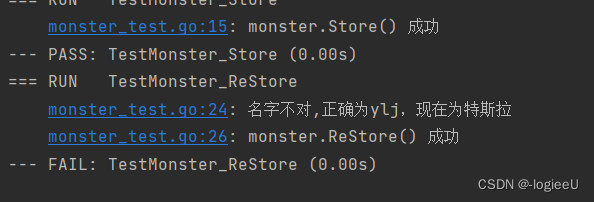
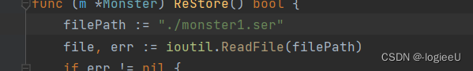
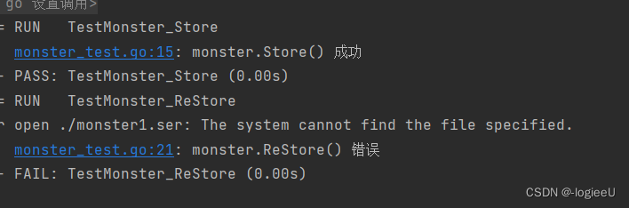

 

[](https://blog.csdn.net/logiee/article/details/126852369)go test单元测试
---------------------------------------------------------------------

#### 目录

*   [go test单元测试](about:blank#go_test_0)
*   *   [基本介绍](about:blank#_3)
    *   [细节介绍](about:blank#_8)
    *   [综合案例](about:blank#_39)

### [](https://blog.csdn.net/logiee/article/details/126852369)基本介绍

go语言中自带有一个轻量级测试框架testing和自带的go test命令来实现单元测试和性能测试，testing框架和其他语言中的测试框架类似，可以基于这个框架写针对的相应函数的测试用例，也可以基于该框架写相应的压力测试用例。通过单元测试，可以解决如下问题：  
1.确保每个函数可以运行，并且保证结果的正确性  
2.确保写出的代码性能较好  
3.单元测试能及时的发现程序设计或实现的逻辑错误，使问题即使暴露，便于问题的定位解决，而性能测试的重点在于发现程序设计上的一些问题，让程序能够在高并发的情况下还能保持稳定。

### [](https://blog.csdn.net/logiee/article/details/126852369)细节介绍

1.  testing框架会自动导入xxx\_test的文件，并且自动调用TestXxx的函数，其中函数名必须时大驼峰命名法。例如TestAdd()
2.  要将测试文件放在被测试的包相同的包内，测试文件将被排除在正常程序包外，但在运行go test命令时将包含测试文件
3.  通常情况TestXxx函数的参数是\*testing.T,其中type T包含：  
    func (\*T) Cleanup  
    Cleanup 注册要在测试（或子测试）及其所有子测试完成时调用的函数。清理函数将按上次添加、先调用的顺序调用。  
    func (\*T) Deadline  
    截止时间报告测试二进制文件将超过 -timeout 标志指定的超时的时间。  
    如果 -timeout 标志指示“无超时”（0），则 ok 结果为假。  
    func (\*T) Error  
    错误等效于“日志”，后跟“失败”。  
    func (\*T) Errorf  
    错误 f 等效于 Logf 后跟失败。  
    func (\*T) Fail  
    Fail 将函数标记为已失败，但继续执行。  
    func (\*T) FailNow  
    FailNow 将函数标记为已失败，并通过调用运行时停止其执行。Goexit（然后运行当前gorutine中的所有延迟调用）。执行将在下一个测试或基准测试中继续。FailNow 必须从运行测试或基准测试函数的量程中调用，而不是从测试期间创建的其他量程调用。调用 FailNow 并不能阻止那些其他的gorutine。  
    func (\*T) Failed  
    失败报告函数是否失败。  
    func (\*T) Fatal  
    致命等同于日志，后跟失败。  
    func (\*T) Fatalf  
    相当于log，后跟失败。  
    func (\*T) Log  
    Log 使用默认格式（类似于 Println）设置其参数的格式，并将文本记录在错误日志中。对于测试，仅当测试失败或设置了 -test.v 标志时，才会打印文本。对于基准测试，始终打印文本以避免性能取决于 -test.v 标志的值。  
    func (\*T) Logf  
    Logf 根据格式（类似于 Printf）设置其参数的格式，并将文本记录在错误日志中。如果未提供，则添加最后一个换行符。对于测试，仅当测试失败或设置了 -test.v 标志时，才会打印文本。对于基准测试，始终打印文本以避免性能取决于 -test.v 标志的值。  
    func (\*T) Skip  
    “跳过”等效于“日志”，后跟“跳过”。  
    更多的参数类型以及方法讲在后续应用中再进行学习。
4.  一个测试文件中可以有多测试函数

### [](https://blog.csdn.net/logiee/article/details/126852369)综合案例

单元测试综合案例要求：

1.  编写一个Monster结构体，字段为Name，Age，Skill
2.  给Monster绑定方法Store，可以将一个Monster变量序列化后保存到文件中
3.  给Monster绑定方法Restore，可以将一个序列化的Monster，从文件中读取，并且反序列化为Monster对象，检查反序列化
4.  编程测试用例文件store\_test.go，编写测试用例函数TestStore和TestReStore经行测试。

* * *

条件一

```
type Monster struct {
	Name  string
	Age   int
	Skill []string
}

```

条件二

```
func (m *Monster) Store() bool {
	data, err := json.Marshal(m)
	if err != nil {
		fmt.Println("err=", err)
		return false
	}
	filePath := "../monster.ser"
	ioutil.WriteFile(filePath, data, 0644)
	return true
}

```

条件三

```
func (m *Monster) ReStore() bool {
	filePath := "../monster.ser"
	file, err := ioutil.ReadFile(filePath)
	if err != nil {
		fmt.Println("err", err)
		return false
	}
	json.Unmarshal(file, m)
	return true
}


```

条件四

```
package Monster

import "testing"

func TestMonster_Store(t *testing.T) {
	monster := Monster{
		Name:  "特斯拉",
		Age:   10,
		Skill: []string{"c", "h"},
	}
	flag := monster.Store()
	if !flag {
		t.Fatalf("monster.Store() 错误")
	}
	t.Logf("monster.Store() 成功")
}
func TestMonster_ReStore(t *testing.T) {
	monster := Monster{}
	flag := monster.ReStore()
	if !flag {
		t.Fatalf("monster.ReStore() 错误")
	}
	if monster.Name != "ylj" {
		t.Errorf("名字不对%v", monster.Name)
	}
	t.Logf("monster.ReStore() 成功")
}


```

现在经行常规测试  
预期报错：名字不对  
  
现在修改反序列化地址  
  
预期会报错地址无法读取地址  


 

  

本文转自 [https://blog.csdn.net/logiee/article/details/126852369](https://blog.csdn.net/logiee/article/details/126852369)，如有侵权，请联系删除。