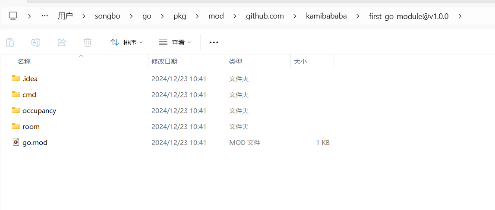

### 项目结构

![Go 程序文件夹/文件组织示例[fig:Go-program-example]](assets/tree_go_program_example.a3426c1b.png)

### go.mod

```golang
module "github.com/kamibababa/first_go_module"

go 1.21.6
```


### room.go,函数首字母大写（public），小写是（private）

```golang
package room

import "fmt"

// display information about a room
func PrintDetails(roomNumber, size, nights int) {
	fmt.Println(roomNumber, ":", size, "people /", nights, " nights ")
}
```

### main.go

```golang
package room

import "fmt"

// display information about a room
func PrintDetails(roomNumber, size, nights int) {
	fmt.Println(roomNumber, ":", size, "people /", nights, " nights ")
}
```

### github新建first_go_module项目并提交

### **为模块创建版本**

Go 模块的版本通常遵循 [语义化版本号 (SemVer)](https://semver.org/)，例如 `v1.0.0`。

1. 为代码库打一个版本标签：

```
git tag v1.0.0
```

1. 推送标签到远程仓库：

```
git push origin v1.0.0
```

------

## 新建另外一个项目引入上面的模块

### go.mod(require引入到模块)

```
module awesomeProject1

go 1.21.6

require github.com/kamibababa/first_go_module v1.0.0

```

### main.go（导入import模块中具体的包）

```golang
package main

import (
	"fmt"
    "github.com/kamibababa/first_go_module/room"
)

func main()  {
	fmt.Println("hello")
	room.PrintDetails(112, 3, 2)
}
```

### 下载下来的包所在位置


