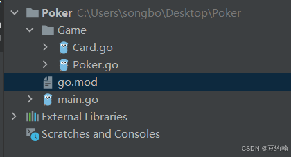

### Card.go
```go
package Game

import strconv

type Card struct {
	suit string
	rank int
}

func (card Card) ToString() string{
	newrank = strconv.Itoa(card.rank)
	switch card.rank {
	case 14
		{
			newrank = A
			break
		}
	case 11
		{
			newrank = J
			break
		}
	case 12
		{
			newrank = Q
			break
		}
	case 13
		{
			newrank = K
			break
		}
	default
		break
	}

	return card.suit + newrank
}

func main() {
	card = Card{红桃,12}
	fmt.Println(card.toString())
}
```
### Poker.go
```go
package Game

import (
	fmt
	mathrand
	sort
)

var	suits = [4]string{红桃,黑桃,方片,草花}

type Poker struct {
	cards [20]Card
}

func (poker Poker)Init(){
	index = 0
	for i = 0; i  4; i++{
		for j = 10; j = 14; j++{
			poker.cards[index] = Card{suits[i],j}
			index++
		}
	}
}

func (poker Poker)Output(){
	index = 0
	for i = 0; i  4; i++{
		for j = 10; j = 14; j++{
			fmt.Print(poker.cards[index].ToString()+ )
			index++
		}
		fmt.Println()
	}
}
func (poker Poker)Shuffle(){
	for i=0; i  20; i++{
		ran_index = rand.Intn(20)
		tmp = poker.cards[i]
		poker.cards[i] = poker.cards[ran_index]
		poker.cards[ran_index] = tmp
	}
}

func (poker Poker)GetOneHand() []Card{
	poker.Shuffle()
	hand = []Card{}
	for i=0; i  5; i++{
		hand = append(hand, poker.cards[i])
	}
	return hand
}
func (poker Poker)GetOneCard(index int) Card{
	return poker.cards[index]
}
func (poker Poker)CheckCardType(hand []Card) string{
	suitMap = make(map[string]int)
	rankMap = make(map[int]int)
	handCopy = make([]Card, 5)
	copy(handCopy, hand)

	for _, card = range hand{
		suitMap[card.suit] = 0
		_, exists = rankMap[card.rank]
		if exists == true {
			rankMap[card.rank]++
		}else{
			rankMap[card.rank] = 1
		}
	}

	isSameColor = false
	isStraight = false

	sort.Slice(handCopy, func(i, j int) bool {
		return handCopy[i].rank  handCopy[j].rank
	})

	if len(suitMap) == 1{
		isSameColor = true
	}

	if handCopy[4].rank - handCopy[0].rank == 4 && len(rankMap) == 5{
		isStraight = true
	}

	if isStraight && isSameColor {
		return 同花顺
	} else if isStraight{
		return 顺子
	} else if isSameColor {
		return 同花
	}

	if len(rankMap) == 4{
		return 一对
	}
	if len(rankMap) == 5{
		return 杂牌
	}

	if len(rankMap) == 2{
		for _, v = range rankMap{
			if v == 4 {
				return 四条
			}
		}
		return 满堂红
	}

	if len(rankMap) == 3{
		for _, v = range rankMap{
			if v == 3 {
				return 三条
			}
		}
		return 两对
	}

	return unknown
}
```
### main.go
```go
package main

import (
	bufio
	fmt
	mathrand
	os
	pokerGame
	strconv
	strings
	time
)
func main() {
	rand.Seed(time.Now().UnixNano())

	poker = Game.Poker{}
	poker.Init()
	poker.Output()
	fmt.Println(after shuffle)
	poker.Shuffle()
	poker.Output()

	mapPrize = make(map[string]int)
	mapPrize[同花顺] = 50
	mapPrize[四条] = 40
	mapPrize[满堂红] = 30
	mapPrize[同花] = 20
	mapPrize[顺子] = 10
	mapPrize[三条] = 5
	mapPrize[两对] = 3
	mapPrize[一对] = -5
	mapPrize[杂牌] = -10

	scanner = bufio.NewScanner(os.Stdin)
	score = 100
	for {
		var bet int;
		fmt.Println(give your bet)
		if scanner.Scan() {
			line = scanner.Text()
			bet, _ = strconv.Atoi(line)
			score -= bet
		}
		fmt.Println(your current score + strconv.Itoa(score))
		hand = poker.GetOneHand()
		for _, card = range hand{
			fmt.Print(card.ToString() +  )
		}

		hand_type = poker.CheckCardType(hand)
		fmt.Println(hand_type)

		fmt.Println(please change card [1-5], enter for no change)


		if scanner.Scan() {
			input = scanner.Text()
			if input != {
				change_cards = strings.Split(input,  )
				for i = 0; i  len(change_cards); i++{
					change_idx, _ = strconv.Atoi(change_cards[i])
					change_idx--
					hand = append(hand,Game.Card{})
					hand[change_idx] = poker.GetOneCard(5+i)
				}
			}
		}

		for _, card = range hand{
			fmt.Print(card.ToString() +  )
		}

		hand_type = poker.CheckCardType(hand)
		fmt.Println(hand_type)

		prize = mapPrize[hand_type]bet
		score += prize
		fmt.Println(your gain prize + strconv.Itoa(prize))
		fmt.Println(your current score + strconv.Itoa(score))
	}
}

```
### go.mod
```go
module poker

go 1.12

```

